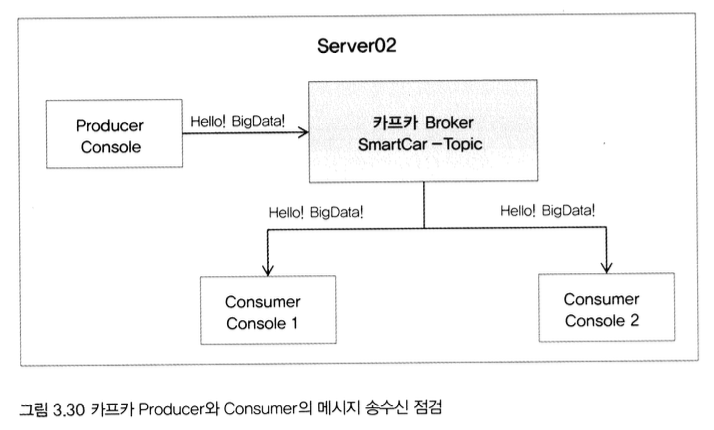

# 0. 이번 장에서 할 것
- 빅데이터 아키텍처의 첫 번째 레이어인 __수집 영역__ 구축
- 스마트카 시뮬레이터로 배치 파일(스마트카 상태 정보)과 실시간 로그(스마트카 운행 정보) 생성
- 이를 플러모가 카프카로 수집

<br>

# 1. Flume 설치
- CM 홈에서 [서비스 추가] - [Flume] 선택
   
- 서버 호스트 `server02.hadoop.com` 선택

<br>

- __Flume Heap Memory 수정__
    - 50Mib -> __100MiB__
       

<br>

# 2. Kafka 설치
- CM 홈에서 [서비스 추가] - [Kafka] 선택
   
- 서버 호스트 `server02.hadoop.com` 선택

<br>

- __카프카에 저장될 메시지 보관 기간 짧게 조정__
    - `Data Retention Time` 7일 -> __10분__
    

<br>

# 3. 플럼 수집 기능 구현
- 플럼에서 2개의 에이전트 구현
    - 스마트카 상태정보 수집하는 `SmartCarInfo Agent`
    - 운전자의 운행정보 수집하는 `DriverCarInfo Agent`

- 에이전트 생성 
  - 플럼이 인식할 수 있는 특정 디렉터리에 `{Agent 고유 이름}.conf` 파일 생성
  - 파일럿 프로젝트에서는 CM에서 제공하는 플럼 구성 정보 설정을 통해 에이전트 편리하게 생성 가능

## 1) SmartCar 에이전트 생성
- CM 홈 [Flume] - [구성]
- `구성 파일` 항목 수정


<br>

- Agent 이름: `SmartCar_Agent`
- 구성 파일   
```conf
#1
SmartCar_Agent.sources  = SmartCarInfo_SpoolSource
SmartCar_Agent.channels = SmartCarInfo_Channel
SmartCar_Agent.sinks    = SmartCarInfo_LoggerSink 

#2
SmartCar_Agent.sources.SmartCarInfo_SpoolSource.type = spooldir
SmartCar_Agent.sources.SmartCarInfo_SpoolSource.spoolDir = /home/pilot-pjt/working/car-batch-log
SmartCar_Agent.sources.SmartCarInfo_SpoolSource.deletePolicy = immediate
SmartCar_Agent.sources.SmartCarInfo_SpoolSource.batchSize = 1000

#3
SmartCar_Agent.channels.SmartCarInfo_Channel.type = memory
SmartCar_Agent.channels.SmartCarInfo_Channel.capacity  = 100000
SmartCar_Agent.channels.SmartCarInfo_Channel.transactionCapacity  = 10000

#4
SmartCar_Agent.sinks.SmartCarInfo_LoggerSink.type = logger

#5
SmartCar_Agent.sources.SmartCarInfo_SpoolSource.channels = SmartCarInfo_Channel
SmartCar_Agent.sinks.SmartCarInfo_LoggerSink.channel = SmartCarInfo_Channel
```

- #1
  - 플럼의 에이전트에서 사용할 Source, Channle, Sink의 각 리소스 변수 정의
- #2
	- 에이전트의 Source 설정
	- #1에서 Source로 선언했던 `SmartCarInfo_SpoolSource` 변수의 type을 `spooldir`로 설정
	- `spooldir` : 지정한 특정 디렉터리를 모니터링하고 있다가 새로운 파일이 생성되면 이벤트를 감지해서 `batchSize` 설정값만큼 읽어서 #3의 Channel에 데이터 전송
- #3 
	- 에이전트의 Channel로서 `SmartCarInfo_Channel`의 type을 `memory`로 설정
	- 채널의 종류) memory / file
	- Memory Channel은 Source로부터 받은 데이터를 메모리 상에 중간 적재 -> 성능 높지만, 안정성 낮음
	- File Channel은 Source에서 전송한 데이터를 받아 로컬 파일시스템 경로인 `dataDirs`에 임시로 저장했다가 Sink에게 데이터 제공 -> 성능 낮지만, 안정성 높음
- #4
	- 에이전트의 최종 목적지
	- SmartCarInfo_LoggerSink의 type을 `logger`로 설정
	- Logger Sink는 수집한 데이터를 테스트 및 디버깅 목적으로 플럼의 표준 출력 로그 파일인 `/var/log/flume-ng/flume-cmf-flume-AGENT-server02.hadoop.com.log`에 출력
- #5
	- Source와 Channel Sink 연결
	- 앞서 정의한 SmartCarInfo_SpoolSource의 채널값을 `SmartCarInfo_Channel`로 설정
	- SmartCarInfo_LoggerSink의 채널값도 `SmartCarInfo_Channel`로 설정
	- File -> Channel -> Sink로 이어지는 에이전트 리소스를 하나로 연결

<br>

## 2) SmartCar 에이전트에 Interceptor 추가
- `Interceptor` : Source와 Channel의 중간에서 데이터를 가공하는 역할
- 플럼의 Source에서 유입되는 데이터 중 일부 데이터를 수정하거나 필요한 데이터만 필터링하는 등 중간에 데이터를 추가/가공/정제하는 데 사용됨
- 플럼에서 데이터 전송 단위 `Event` - Header와 본문 Body로 구성됨
- Interceptor는 Event의 Header에 특정값을 추가하거나 Body에 데이터를 가공하는 기능으로 활용됨

<br>

- 파일럿 프로젝트에서는 SmartCarInfo 로그 파일을 수집하는데 총 4개의 Interceptor를 추가할 것
- 이번 장에서는 `Filter Interceptor` 하나만 추가
- 앞서 작성한 SmartCarInfo 에이전트 수정해서 Filter Interceptor 사용


<br>

- CM 홈 [Flume] - [구성] - [구성 파일]
- Source와 Channel 사이에 Interceptor 추가
```conf
SmartCar_Agent.sources  = SmartCarInfo_SpoolSource
SmartCar_Agent.channels = SmartCarInfo_Channel
SmartCar_Agent.sinks    = SmartCarInfo_LoggerSink 

SmartCar_Agent.sources.SmartCarInfo_SpoolSource.type = spooldir
SmartCar_Agent.sources.SmartCarInfo_SpoolSource.spoolDir = /home/pilot-pjt/working/car-batch-log
SmartCar_Agent.sources.SmartCarInfo_SpoolSource.deletePolicy = immediate
SmartCar_Agent.sources.SmartCarInfo_SpoolSource.batchSize = 1000

#1
SmartCar_Agent.sources.SmartCarInfo_SpoolSource.interceptors = filterInterceptor

#2
SmartCar_Agent.sources.SmartCarInfo_SpoolSource.interceptors.filterInterceptor.type = regex_filter
SmartCar_Agent.sources.SmartCarInfo_SpoolSource.interceptors.filterInterceptor.regex = ^\\d{14}
SmartCar_Agent.sources.SmartCarInfo_SpoolSource.interceptors.filterInterceptor.excludeEvents = false


SmartCar_Agent.channels.SmartCarInfo_Channel.type = memory
SmartCar_Agent.channels.SmartCarInfo_Channel.capacity  = 100000
SmartCar_Agent.channels.SmartCarInfo_Channel.transactionCapacity  = 10000


SmartCar_Agent.sinks.SmartCarInfo_LoggerSink.type = logger

SmartCar_Agent.sources.SmartCarInfo_SpoolSource.channels = SmartCarInfo_Channel
SmartCar_Agent.sinks.SmartCarInfo_LoggerSink.channel = SmartCarInfo_Channel
```

- #1
	- 수집 데이터를 필터링하기 위해 `filterInterceptor` 변수를 선언해서 SmartCarInfo_SpoolSource에 할당
- #2
	- filterInterceptor의 type을 `regex_filter`로 설정
	- 정규 표현식(Regular Expression)을 이용해 수집 데이터를 필터링할 때 유용하게 사용
	- 아래 이미지에서 스마트카 로그 생성기가 만든 로그 파일 내용을 보면, 중간에 로그 포맷의 형식을 알리는 메타 정보가 포함되어 있음
	- 이 메타 정보를 수집 데이터에서 제외하고, 필요한 데이터만 수집해야 함
	- 이때 간단한 정규 표현식을 이용해서 해결 가능
		- 스마트카 로그의 경우) 정상적인 로그 데이터가 발생했을 때 14자리의 날짜 형식을 가짐
		- 이 14자리 날짜 형식으로 시작하는 데이터에 대한 정규 표현식 `^\\d{14}`를 "regex" 속성에 설정
		- "excludeEvents" 속성이 __false__ 로 되어있는데, __true__ 로 하면 반대로 제외 대상만 수집하게 됨

<br>

## 3) DriverCarInfo 에이전트 생성
- 앞서 작성한 SmartCar 에이전트에 DriverCarInfo 에이전트를 위한 Source, Channel, Sink를 추가하여 생성
- 한 개의 플럼 에이전트 파일에 여러 개의 에이전트를 만들어 사용

<br>

- __DriverCarInfo 리소스 변수 추가__
```conf
#1
SmartCar_Agent.sources  = SmartCarInfo_SpoolSource DriverCarInfo_TailSource
SmartCar_Agent.channels = SmartCarInfo_Channel DriverCarInfo_Channel
SmartCar_Agent.sinks    = SmartCarInfo_LoggerSink DriverCarInfo_KafkaSink

SmartCar_Agent.sources.SmartCarInfo_SpoolSource.type = spooldir
SmartCar_Agent.sources.SmartCarInfo_SpoolSource.spoolDir = /home/pilot-pjt/working /car-batch-log
SmartCar_Agent.sources.SmartCarInfo_SpoolSource.deletePolicy = immediate
SmartCar_Agent.sources.SmartCarInfo_SpoolSource.batchSize = 1000

SmartCar_Agent.sources.SmartCarInfo_SpoolSource.interceptors = filterInterceptor

SmartCar_Agent.sources.SmartCarInfo_SpoolSource.interceptors.filterInterceptor.type = regex_filter
SmartCar_Agent.sources.SmartCarInfo_SpoolSource.interceptors.filterInterceptor.regex = ^\\d{14}
SmartCar_Agent.sources.SmartCarInfo_SpoolSource.interceptors.filterInterceptor.excludeEvents = false


SmartCar_Agent.channels.SmartCarInfo_Channel.type = memory
SmartCar_Agent.channels.SmartCarInfo_Channel.capacity  = 100000
SmartCar_Agent.channels.SmartCarInfo_Channel.transactionCapacity  = 10000


SmartCar_Agent.sinks.SmartCarInfo_LoggerSink.type = logger

SmartCar_Agent.sources.SmartCarInfo_SpoolSource.channels = SmartCarInfo_Channel
SmartCar_Agent.sinks.SmartCarInfo_LoggerSink.channel = SmartCarInfo_Channel
```
- #1
	- 에이전트의 Source, Channel, Sink에 DriverCarInfo 리소스 변수 추가

<br>

- __DriverCarInfo 설정 추가__

```conf
SmartCar_Agent.sources  = SmartCarInfo_SpoolSource DriverCarInfo_TailSource
SmartCar_Agent.channels = SmartCarInfo_Channel DriverCarInfo_Channel
SmartCar_Agent.sinks    = SmartCarInfo_LoggerSink DriverCarInfo_KafkaSink

SmartCar_Agent.sources.SmartCarInfo_SpoolSource.type = spooldir
SmartCar_Agent.sources.SmartCarInfo_SpoolSource.spoolDir = /home/pilot-pjt/working/car-batch-log
SmartCar_Agent.sources.SmartCarInfo_SpoolSource.deletePolicy = immediate
SmartCar_Agent.sources.SmartCarInfo_SpoolSource.batchSize = 1000

SmartCar_Agent.sources.SmartCarInfo_SpoolSource.interceptors = filterInterceptor

SmartCar_Agent.sources.SmartCarInfo_SpoolSource.interceptors.filterInterceptor.type = regex_filter
SmartCar_Agent.sources.SmartCarInfo_SpoolSource.interceptors.filterInterceptor.regex = ^\\d{14}
SmartCar_Agent.sources.SmartCarInfo_SpoolSource.interceptors.filterInterceptor.excludeEvents = false


SmartCar_Agent.channels.SmartCarInfo_Channel.type = memory
SmartCar_Agent.channels.SmartCarInfo_Channel.capacity  = 100000
SmartCar_Agent.channels.SmartCarInfo_Channel.transactionCapacity  = 10000


SmartCar_Agent.sinks.SmartCarInfo_LoggerSink.type = logger

SmartCar_Agent.sources.SmartCarInfo_SpoolSource.channels = SmartCarInfo_Channel
SmartCar_Agent.sinks.SmartCarInfo_LoggerSink.channel = SmartCarInfo_Channel

#1
SmartCar_Agent.sources.DriverCarInfo_TailSource.type = exec
SmartCar_Agent.sources.DriverCarInfo_TailSource.command = tail -F /home/pilot-pjt/working/driver-realtime-log/SmartCarDriverInfo.log
SmartCar_Agent.sources.DriverCarInfo_TailSource.restart = true
SmartCar_Agent.sources.DriverCarInfo_TailSource.batchSize = 1000

SmartCar_Agent.sources.DriverCarInfo_TailSource.interceptors = filterInterceptor2

#2
SmartCar_Agent.sources.DriverCarInfo_TailSource.interceptors.filterInterceptor2.type = regex_filter
SmartCar_Agent.sources.DriverCarInfo_TailSource.interceptors.filterInterceptor2.regex = ^\\d{14}
SmartCar_Agent.sources.DriverCarInfo_TailSource.interceptors.filterInterceptor2.excludeEvents = false

#3
SmartCar_Agent.sinks.DriverCarInfo_KafkaSink.type = org.apache.flume.sink.kafka.KafkaSink
SmartCar_Agent.sinks.DriverCarInfo_KafkaSink.topic = SmartCar-Topic
SmartCar_Agent.sinks.DriverCarInfo_KafkaSink.brokerList = server02.hadoop.com:9092
SmartCar_Agent.sinks.DriverCarInfo_KafkaSink.requiredAcks = 1
SmartCar_Agent.sinks.DriverCarInfo_KafkaSink.batchSize = 1000

#4
SmartCar_Agent.channels.DriverCarInfo_Channel.type = memory
SmartCar_Agent.channels.DriverCarInfo_Channel.capacity= 100000
SmartCar_Agent.channels.DriverCarInfo_Channel.transactionCapacity = 10000

#5
SmartCar_Agent.sources.DriverCarInfo_TailSource.channels = DriverCarInfo_Channel
SmartCar_Agent.sinks.DriverCarInfo_KafkaSink.channel = DriverCarInfo_Channel
```

- 앞서 선언한 SmartCarInfo 에이전트와 유사하게 Source, Interceptor, Channel, Sink 순서대로 정의
- 일부 Source와 Sink 유형이 달라짐

<br>

- #1 
	- Source의 type이 `exec`
	- `exec`는 플럼 외부에서 수행한 명령의 결과를 플럼의 Event로 가져와 수집할 수 있는 기능 제공
	- 스마트카 운전자의 운행 정보가 로그 시뮬레이터를 통해 `/home/pilot-pjt/working/driver-realtime-log/SmartCarDriverInfo.log`에 생성
	-> 리눅스의 `tail` 명령을 플럼의 `exec`를 실행해서 운전자의 실시간 운행 정보 수집

- #2
	- Interceptor 정의 
	- 데이터 필터링을 위한 `regex_filter`만 추가

- #3
	- 스마트카 운전자의 실시간 운행 정보는 플럼에서 수집과 동시에 카프카로 전송
	- 플럼의 `KafkaSink`의 내용을 보면, 카프카 브로커 서버가 실행중인 server02.hadoop.com:9092에 연결해서 SmartCar-Topic에 데이터를 100개의 배치 크기로 전송

- #4
	- DriverCarInfo의 Channel을 `Memory Channel`로 선언

- #5
	- DriverCarInfo의 Source와 Sink의 Channel을 앞서 정의한 DriverCarInfo_Channel로 설정해서 Source-Channel-Sink 구조 완성

<br>

# 4. 카프카 기능 구현
- 카프카에 대한 직접적인 기능 구현은 하지 않음
- 이미 플럼의 `DriverCarInfo_KafkaSink`를 통해 수집한 실시간 데이터를 카프카에 전송하는 기능 구현은 끝났기 때문
- 카프카 명령어를 이용해 카프카의 `브로커` 안에 앞으로 사용하게 될 토픽 생성 & 카프카의 `Producer` 명령을 통해 토픽에 데이터 전송
- 토픽에 들어간 데이터를 다시 카프카의 `Consumer` 명령어로 수신

<br>

## 1) 카프카 Topic 생성
- 카프카가 설치되어 있는 Server02에서 카프카의 `CLI` 명령어를 이용해 다양한 카프카 기능 사용
- PuTTY로 Server02에 SSH 접속 - root 계정으로 로그인
- 아래 카프카 토픽 명령어로 SmartCar-Topic 생성
```bash
kafka-topics --create --zookeeper server02.hadoop.2181 --replication-factor 1 --partitions 1 --topic SmartCar-Topic
```


<br>

- 위 명령어 실행하고 `Created Topic SmartCar-Topic` 메시지가 나오면 토픽이 정상적으로 생성된 것
- `--zookeeper` 옵션
	- 토픽의 메타 정보들이 Zookeeper의 Z노드에 만들어지고 관리됨
	- `replication-factor` 옵션은 카프카를 다중 Broker로 만들고, 전송한 데이터를 replication-factor 개수만큼 복제하게 됨. 파일럿 플젝은 단일 카프카 브로커 -> 복제 개수 1
	- `partitions` 옵션은 해당 Topic에 데이터들은 partitions 개수만큼 분리 저장하게 됨. 다중 Broker에서 쓰기/읽기 성능 향상을 위해 사용

<br>

- `--topic` 옵션
	- 파일럿 환경에서 사용할 토픽명 정의
	- __SmartCar-Topic__이라는 이름으로 토픽 정의
	- 플럼의 DriverCarInfo_KafkaSink에서 설정한 토픽 이름과 같아야 함
	- 토픽 삭제 명령어
	`kafka-topics --delete --zookeeper server02.hadoop.com:2181 --topic 토픽명`

<br>

## 2) 카프카 Producer 사용
- Server02 SSH 접속 후 아래 명령 실행
```bash
kafka-console-producer --broker-list server02.hadoop.com:9092 -topic SmartCar-Topic
```
- 이후 `Hello! BigData!` 를 입력하고 엔터 키를 누름
- 에러 메시지가 없으면 __SmartCar-Topic__에 "Hello! BigData!" 메시지를 성공적으로 전송한 것

.png)   
.png)

<br>

- 카프카 Producer와 Consumer 기능 점검



	- 앞서 Producer가 전송한 "Hello! BigData!" 메시지는 아직 카프카 토픽에 머물러 있는 상태
	- Consumer 콘솔 1, 2를 실행해서 __SmartCar-Topic__에 연결하면 "Hello! BigData!" 메시지를 Consumer가 동시에 수신받게 될 것

<br>

## 3) 카프카 Consumer 사용
- Server02에 SSH 터미널을 2개 열어서 각각에 아래 카프카 Consumer 명령 실행
```bash
kafka-console-consumer --bootstrap-server server02.hadoop.com:9092 --topic SmartCar-Topic --partition 0 --from-beginning
```

<br>

- 실행과 동시에 Producer에서 입력했던 "Hello! BigData!"가 출력되는 것을 볼 수 있음   

.png)
.png)

- 위에서 "Hello! BigData!"를 입력했던 Producer 콘솔창에서 메시지를 전송할 때마다 2개의 Consumer 콘솔창에 브로드캐스트되어 동일 메시지가 수신됨

<br>

# 5. 수집 기능 테스트

## 1) SmartCar 로그 시뮬레이터 작동
- 2016년 1월 1일에 3대의 스마트카 로그만 발생시켜 보기

### 1) Server02에 SSH 접속 후 bigdata.smartcar.loggen-1.0.jar가 위치한 곳으로 이동
```bash
cd /home/pilot-pjt/working
```

<br>

### 2) 다음 명령으로 2개의 스마트카 로그 시뮬레이터를 백그라운드 방식으로 실행
```bash
java -cp bigdata.smartcar.loggen-1.0.jar com.wikibook.bigdata.smartcar.loggen.CarLogMain 20160101 3 &
java -cp bigdata.smartcar.loggen-1.0.jar com.wikibook.bigdata.smartcar.loggen.DriverLogMain 20160101 3 &
```


- 2016년 1월 1일에 3대의 스마트카에 대한 상태 정보와 운전자의 운행 정보 생성 시작

<br>

### 3) 정상적으로 시뮬레이터가 작동되고 있는지 아래 내용으로 확인
- /home/pilot-pjt/working/SmartCar 경로에 SmartCarStatusInfo_20160101.txt 파일이 생성됐는지 확인
- 파일의 내용 확인해보면 3대의 스마트카 상태 정보가 기록된 것을 볼 수 있음
```bash
cd /home/pilot-pjt/working/SmartCar
vi SmartCarStatusInfo_20160101.txt
```


<br>

- /home/pilot-pjt/working/driver-realtime-log 경로에 SmartCarDriverInfo.log 파일 생성됐는지 확인
- tail -f SmartCarDriverInfo.log 명령을 통해 3대의 스마트카 운전자의 운행 정보가 실시간으로 발생하는 것을 볼 수 있음
```bash
cd /home/pilot-pjt/working/driver-realtime-log
tail -f SmartCarDriverInfo.log
```


<br>

### 4) /home/pilot-pjt/working/SmartCar 경로에 만들어진 SmartCarStatusInfo_20160101.txt 파일을 플럼 SmartCarInfo 에이전트의 SpoolDir 경로로 옮김
```bash
mv /home/pilot-pjt/working/SmartCar/SmartCarStatusInfo_20160101.txt /home/pilot-pjt/working/car-batch-log/
```


<br>

## 2) 플럼 에이전트 작동
- 플럼 에이전트를 작동시켜 스마트카 로그 시뮬레이터가 만들어낸 두 유형의 로그 수집
- CM 홈 - [Flume] - [재시작] - 플럼 에이전트 재기동

<br>

## 3) 카프카 Consumer 작동
- Server02에 접속하여 다음과 같은 카프카 명령 실행
- 이전에 사용한 Consumer 명령과 -from-beginning 옵션은 생략
	- -from-beginning 옵션: 해당 토픽에 저장된 첫 데이터부터 마지막 데이터까지 일괄 수신 후 대기하게 됨
	- 여기서는 실시간으로 발생된 데이터만 수신할 것이므로 해당 옵션 제외

<br>

```bash
kafka-console-consumer --bootstrap-server server02.hadoop.com:9092 --topic SmartCar-Topic --partition 0
```


<br>

- 앞서 실행한 시뮬레이터에 의해 스마트카의 운행 로그 데이터가 실시간으로 카프카에 유입되는 것을 확인할 수 있음

<br>

## 4) 수집 기능 점검

### 1) 스마트카의 상태 정보 로그 파일이 플럼의 표준 출력 로그로 전송됐는지 리눅스 tail 명령어로 확인
```bash
tail -f /var/log/flume-ng/flume-cmf-flume-AGENT-server02.hadoop.com.log
```

<br>

- 아래 그림처럼 수집된 스마트카의 상태값 데이터가 출력되면 성공적으로 수집되고 있는 것

.png)

- 참고로 출력되고 있는 로그의 내용을 보면, 플럼의 데이터 전송 단위인 Event가 Header와 Body 구조로 분리된 것을 확인할 수 있음

<br>

### 2) 스마트카 운전자의 실시간 운전 정보인 DriverCarInfo가 정상적으로 수집되는지 확인
- 앞서 실행했던 카프카의 Consumer 콘솔창 확인
```bash
kafka-console-consumer --bootstrap-server server02.hadoop.com:9092 --topic SmartCar-Topic --partition 0
```

<br>

- 아래와 같이 스마트카의 운전자 정보가 실시간으로 수집되고 있는지 확인할 수 있음

.png)

<br>

### 3) 백그라운드로 실행했던 스마트카 로그 시뮬레이터 모두 종료
```bash
ps -ef | grep smartcar.log
``` 

<br>

- 위 명령어로 조회된 두 자바 프로세스 (CarLogMain, DriverLogMain)의 pid를 찾아 강제 종료
```bash
kill -9 [pid]
```

<br>

# 6. 파일럿 환경의 로그 확인
- Hadoop 에코시스템 서버들의 로그 위치 : /var/log/디렉터리(cloudera, Hadoop, Oozie 등)
- Redis 서버 로그 위치 : /var/log/redis_6379.log
- Storm 서버 로그 위치 : /var/log/storm/
- Zeppelin 서버 로그 위치 : /home/pilot-pjt/zeppelin-0.8.2-bin-all/logs

<br>

# 7. 파일럿 환경에서 HDFS 문제 발생
- 개인의 파일럿 프로젝트 환경은 가상머신으로 구성되어 있어 비정상적인 종료가 자주 발생할 수 있음
- 이때 HDFS 상에 CORRUPT BLOCKS/FILES 같은 문제가 발생하거나, Safe 모드로 전환되어 빠져나오지 못하는 경우가 자주 발생
- 파일럿 환경의 일부 기능 또는 설치 중에 문제가 발생한다면 HDFS의 파일/블록 깨짐 또는 Safe 모드 전환 여부 체크해야 함

<br>

- HDFS 파일 시스템 검사 : `hdfs fsck /`
- HDFS에 Safe 모드 발생 후 빠져나오지 못할 경우 Safe 모드 강제 해제 : `hdfs dfsadmin -safamode leave`
- HDFS에 CORRUPT BLOCKS/FILES 등이 발생해 복구가 불가능한 경우
	- 손상된 파일 강제 삭제 : `hdfs fsck / -delete`
	- 손상된 파일을 /lost + found 디렉터리로 이동 : `hdfs fsck / -move`