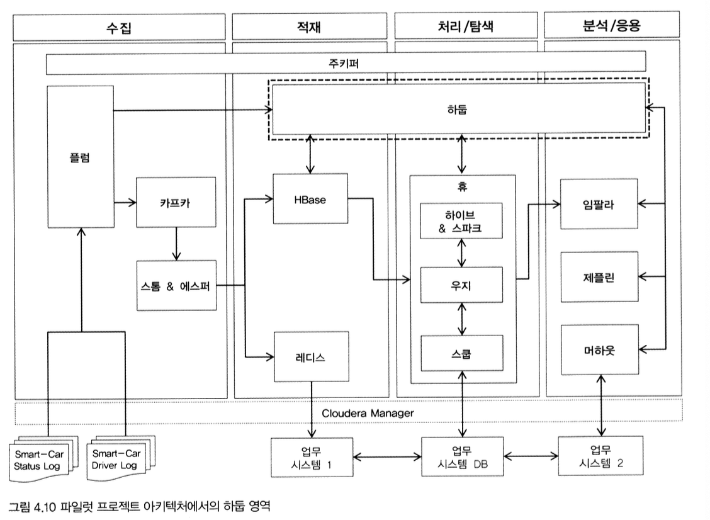

[출처: 실무로 배우는 빅데이터 기술, 김강원 저]

<br>

# 1. 빅데이터 적재 개요

- CH03에서 수집한 데이터를 어디에, 어떻게 저장할 것인가
- 수집한 데이터의 특징에 따라 처리 방식과 적재 위치가 달라질 수 있음

<br>

- 데이터 발생 주기에 따라 **일괄 배치성 데이터**인지, **실시간 스트림 데이터**인지
- 데이터 형식에 따라 가공 처리나 사전 검증 작업을 할 것인지
- 적재한 데이터를 어떤 비즈니스 요건에서 활용하느냐에 따라 적재 대상 위치가 달라질 수도 있음 -> 분산 파일, NoSQL, 메모리 캐시 등으로 구분해서 저장


<br>

- 적재는 빅데이터 시스템의 중심에 위치해 중요한 만큼, 관련 SW가 다양하면서 기술 복잡도도 매우 높음
- CH04에서는 일 단위로 만들어지는 스마트카의 상태 정보 로그 파일(약 100MB) 적재
- CH05에서는 스마트카 운전자의 실시간 운행 정보인 실시간 로그(약 4K/1건) 분석 적재

<br>

- 이번 장에서는 대용량 로그 파일의 적재 다룸

<br>

# 2. 하둡
## 1) 하둡 소개
- 빅데이터의 에코시스템들은 대부분 하둡을 위해 존재하고 하둡에 의존해서 발전해 가고 있다해도 과언이 아닐 정도로 빅데이터의 핵심 소프트웨어임
- 하둡의 두 가지 기능
    - 대용량 데이터 분산 저장
    - 분산 저장된 데이터를 가공/분석 처리

## 2) 하둡의 맵리듀스
 - 분산 병렬 처리에서의 핵심
    - 여러 컴퓨터에 분산 저장되어 있는 데이터로부터 어떻게 효율적으로 일을 나눠서 실행시킬 수 있느냐
    - 여러 컴퓨터가 나눠서 실행한 결과들을 어떻게 하나로 모으냐
- 이를 쉽고 편리하게 지원하는 프레임워크: **하둡의 맵리듀스(MapReduce)**
- 분산 컴퓨팅 기술을 이해하는 중요한 열쇠

<br>

   

```
1) 고객정보가 담긴 1GB의 파일을 100MB 파일 10개로 나눠서 10대의 서버(하둡 데이터노드)에 분산 저장 (나눠진 100MB 파일을 블록 파일이라 부르며, 일반적으로 128MB 블록 단위로 처리)
2) 전체 고객정보에서 VIP 고객의 평균 연봉 조회 쿼리 실행 -> 10대의 서버에 분산 저장된 100MB의 고객정보 파일로부터 Map 프로그램이 각각 생성
3) 실행된 Map 프로그램은 100MB의 고객정보 파일에서 VIP 고객정보만 추출한 후, 작아진 파일(2~8MB) 크기로 Server-11(Reduce)로 전송
4) Server-11에서 Reduce 프로그램이 실행되어 Server-01(Map01) ~ Server-10(Map02)이 전송한 VIP 고객정보를 merge(50MB)해 평균을 구하고 결과 파일(1KB) 생성
```

<br>

- 1~4의 과정은 대용량 데이터에 대한 처리를 여러 대의 서버들이 나누어 작업함으로써 한 대의 고성능 서버가 처리하기 힘든 작업을 신속하게 처리
- 맵리듀스 프로그램에서는 내부적으로 Split, Spill, Sort, Partition, Fetch, Shuffle, Merge 등 다양한 메커니즘들이 작동하며, 이 과정을 잘 이해하고 있어야 분산 환경에서 발생하는 다양한 문제에 빠르게 대처할 수 있음

<br>

## 3) 하둡의 기본 요소
|구성요소|설명|
|---|---|
|DataNode | 블록(64MB / 128MB 등) 단위로 분할된 대용량 파일들이 DataNode의 디스크에 저장 및 관리|
|NameNode | DataNode에 저장된 파일들의 메타 정보를 메모리 상에서 로드해서 관리|
|EditsLog | 파일들의 변경 이력(수정, 삭제 등) 정보가 저장되는 로그 파일|
|FsImage | NameNode의 메모리 상에 올라와 있는 메타 정보를 스냅샷 이미지로 만들어 생성한 파일|
|[Ver.1.x] SecondaryNameNode | NameNode의 FsImage와 EditsLog 파일을 주기적으로 유지 관리해주는 체크포인팅 노드|
|[Ver.1.x] MapReduce v1 | DataNode에 분산 저장된 파일이 스플릿(Map)되어 다양한 연산을 수행한 뒤, 그 결과를 다시 병합(Reduce)하는 분산 프로그래밍 기법|
|[Ver.1.x] JobTracker | 맵리듀스의 job을 실행하면서 태스크에 할당하고, 전체 job에 대해 리소스 분배 및 스케줄링|
|[Ver.1.x] TaskTracker | JobTracker가 요청한 맵리듀스 프로그램이 실행되는 태스크 <br> 이때 맵 태스크와 리듀스 태스크가 생성됨 | 
|[Ver.2.x] Active/Stand-By NameNode | NameNode를 이중화하여 서비스 중인 Active NameNode와 실패 처리를 대비한 Standby NameNode로 구성 | 
|[Ver.2.x] MapReduce v2 / YARN | 하둡 클러스터 내의 자원을 중앙 관리하고, 그 위에 다양한 애플리케이션을 실행 및 관리가 가능하도록 확장성과 호환성을 높인 하둡 2.x의 플랫폼|
|[Ver.2.x] ResourceManager | 하둡 클러스터 내의 자원을 중앙 관리하면서, 작업 요청시 스케줄링 정책에 따라 자원을 분배해서 실행시키고 모니터링 | 
|[Ver.2.x] NodeManager | 하둡 클러스터의 DataNode마다 실행되면서 Container를 실행시키고 라이프 사이클을 관리 | 
|[Ver.2.x] Container | DataNode의 사용 가능한 리소스를 Container 단위로 할당해서 구성 | 
|[Ver.2.x] ApplicationManager | 애플리케이션이 실행되면 생성됨 <br> NodeManager에게 애플리케이션이 실행될 Container를 요청하고, 그 위에서 애플리케이션 실행 및 관리|
|[Ver.2.x] JournalNode | 3개 이상의 노드로 구성되어 EditsLog를 각 노드에 복제 관리 <br> Active NameNode는 EditsLog에 쓰기만을 수행하고, Standby NameNode는 읽기만을 실행 |

<br>

## 4) 하둡 아키텍처

#### 1) 하둡 1.x 버전   
   

- 클라이언트에서 하둡에 파일 읽기/쓰기를 할 때는 우선 NameNode를 참조해서 파일읅 읽기/쓰기 할 DataNode 정보 전달받음
- 클라이언트는 해당 정보를 이용해 DataNode에 직접 연결하여 파일 읽기/쓰기
- 하둡에 적재된 데이터를 분석해야 할 때는 클라이언트가 JobTracker에게 맵리듀스 실행 요청
- JobTracker가 스케줄링 정책에 따라 작업할 DataNode / TaskTracker 선정

<br>

- 선정된 TaskTracker에 맵리듀스 프로그램이 전달되어 저장된 파일들을 이용해 맵리듀스 작업 실행됨
- 하지만, 하둡 1.x 아키텍처에는 여러 문제점이 있는데, 그중 하나가 NameNode의 이중화 기능 미지원으로 SPOF가 존재한다는 점
    - `SPOF` (단일 고장점) : 시스템 구성 요소 중에서 동작하지 않으면 전체 시스템이 중단되는 요소
    - 하둡에서 SPOF는 NameNode
    - NameNode가 정상적으로 작동하지 않으면 모든 클라이언트가 HDFS에 접근 불가 -> 모든 작업이 중지되고 파일을 읽거나 쓸 수 없게 됨
    - NameNode 파일 시스템 이미지에 HDFS의 디렉터리 구조와 파일 위치가 저장되어 있기 때문에, 문제가 생기면 블록에 접근할 수 있는 통로가 사라짐
    
#### 2) 하둡 2.x 버전


<br>

- 1.x 아키텍처의 문제점을 개선하기 위한 다양한 컴포넌트 교체 및 추가
- 클라이언트가 DataNode로부터 파일을 읽고 쓰기 전에 NameNode를 참조하게 되는데, 이때 1.x 버전과 다르게 `Active`/`Standby`로 이중화 되어있음을 알 수 있음
- 또한, NameNode의 메모리에서 관리되는 파일들의 네임스페이스 정보를 주기적으로 관리하기 위해 `JournalNode`가 추가되었고, `주키퍼`까지 사용됨

<br>

- 가장 큰 변화는 JobTracker, TaskTracker 대신 `Resource Manager`, `Node Manager`가 생긴 것
- `Resource Manager`는 Node Manager의 리소스 현황들을 종합적으로 수집해가며 작업 실행을 위한 최적의 DataNode를 찾아주어 효율적인 잡 스케줄링 가능해짐 <br>
\+ 1.x에서 발생했던 DataNode의 리소스 불균형 현상 문제도 해결
- `NodeManager`의 Container, Application Master는 1.x의 맵리듀스 잡 외에도 다양한 애플리케이션을 DataNode에서 실행 및 관리할 수 있게 확장됨
- 이렇게 변화된 하둡 2.x 플랫폼을 `YARN`이라고 함

<br>

## 5) 하둡 활용 방안
- 파일럿 프로젝트에서의 하둡의 역할   


<br>

- 스마트카 상태 정보 로그
    - 비교적 큰 크기의 파일로서, `HDFS`의 특정 디렉터리에 **일자** 단위로 파티션해서 적재
    - 이렇게 일 단위로 분리 적재된 데이터는 일/주/월/년 별로 스마트카의 다양한 시계열 집계 분석 효율적으로 수행 가능
    - 데이터를 재적재해야 하는 경우, 전체 데이터가 아닌 해당 파티션의 데이터만 재적재할 수 있다는 장점이 있음
- 파일럿 환경에서는 이러한 일련의 작업을 처리하기 위해 주로 `하이브` 이용
- 대규모 하이브 작업에서는 분산 병렬 처리를 위해 `맵리듀스` 프로세스가 내부적으로 작동
- 하이브에서 처리된 결과는 다시 `HDFS`의 특정 영역(Hive Data Warehouse)에 저장되고, 이 데이터를 스마트카의 고급 분석으로까지 확장해서 사용

<br>

# 3. 주키퍼
## 1) 주키퍼 소개
- 수십~수천 대의 서버에 설치되어 있는 빅데이터 분산 환경을 더욱 효율적으로 관리하기 위해서는 서버 간의 정보를 쉽고 안전하게 공유해야 함
- `아파치 주키퍼`: 공유된 정보를 이용해 서버 간의 중요한 이벤트를 관리하며 상호작용을 조율해주는 코디네이터 시스템 (분산 코디네이터)
    - 이벤트: 분산 락, 순서 제어, 부하 분산, 네임서비스 등
- 주키퍼는 하둡, HBase, 카프카, 스톰 등의 분산 노드 관리에 사용 중

## 2) 주요 구성 요소
|주요 구성 요소 | 설명|
|---|---|
|Client|주키퍼의 ZNode에 담긴 데이터에 대한 쓰기, 읽기, 삭제 등의 작업을 요청하는 클라이언트|
|ZNode|주키퍼 서버에 생성되는 파일시스템의 디렉터리 개념 <br> 클라이언트의 요청 정보를 계층적으로 관리 <br> (버전, 접근 권한, 상태, 모니터링 객체 관리 등의 기능 지원)|
|Ensemble|3대 이상의 주키퍼 서버를 하나의 클러스터로 구성한 HA 아키텍처|
|Leader Server | Ensemble 안에는 유일한 리더 서버가 선출되어 존재 <br> 클라이언트의 요청을 받은 서버는 해당 요청을 리더 서버에게 전달하고, 리더 서버는 모든 팔로워 서버에게 클라이언트 요청이 전달되도록 보장
|Follwer Server| Ensemble 안에서 한 대의 리더 서버를 제외한 나머지 서버 <br> 리더 서버와 메시지를 주고받으면서 ZNode의 데이터를 동기화하고, 리더 서버에 문제가 발생할 경우 내부적으로 새로운 리더를 선출하는 역할 수행

<br>

## 3) 주키퍼 아키텍처
- 주키퍼는 3대 이상의 **홀수 개**의 서버로 구성되어야 함
- 그 중 1대는 반드시 **리더 서버**가 되고, 나머지 서버는 **팔로워 서버**가 됨
- 팔로워 서버 1에 저장된 ZNode 정보는 리더 서버에 전달되고, 리더 서버는 다른 모든 팔로워 서버에 요청받은 ZNode 정보를 브로드캐스트

<br>

## 4) 주키퍼 활용 방안
- 파일럿 프로젝트에서는 주키퍼를 직접적으로 활용하지 않음
- 하지만, 사용되는 하둡, HBase, 카프카, 스톰 내부에서 주키퍼에 의존해 클러스터 멤버십 기능 및 환경설정의 동기화 등 사용 -> 중요한 SW!

<br>

# 4. 적재 아키텍처
## 1) 적재 요구사항
- `요구사항 1` : 차량의 다양한 장치로부터 발생하는 로그 파일을 수집해서 기능별 상태 점검
- `요구사항 2` : 운전자의 운행 정보가 담긴 로그를 실시간으로 수집해서 주행 패턴 분석

<br>

- 이번 장에서는 요구사항 1에 대해 집중적으로 다룰 것
- 주요 기술 요소로 하둡, 플럼 활용할 것
- 이를 통해 스마트카 데이터 안전하게 수집/적재

<br>

- **요구사항 구체화 및 분석**   

|적재 요구사항 구체화|분석 및 해결 방안|
|---|---|
|1. 100대에 달하는 스마트카들의 상태 정보가 일 단위로 취합되어 제공됨 | 플럼에서 수집 발생 시점의 날짜를 HdfsSink에 전달해서 해당 날짜 단위로 적재|
|2. 매일 100대의 스마트카 상태 정보는 약 100MB 정도이며, 220만 건의 상태 정보가 발생함 | 1년 적재 시 8억 건 이상의 데이터가 적재되며, 연 단위 분석에 하둡의 병렬 처리 사용|
|3. 스마트카의 상태 정보 데이터의 발생일과 수집/적재되는 날짜가 다를 수 있음 | 수집/적재되는 모든 데이터마다 데이터 발생일 외에 수집/적재 처리되어야 하는 처리일 추가|
|4. 적재된 스마트카들의 상태 정보를 일/월/년 단위로 분석할 수 있어야 함 | HDFS에 수집 일자별로 디렉터리 경로를 만들어서 적재|
|5. 적재 및 생성되는 파일은 HDFS의 특성을 잘 고려해야 함 | 플럼의 HdfsSink의 옵션을 파일럿 프로젝트의 HDFS에 최적화해서 설정 | 
|6. 적재가 완료된 후에는 원천 파일이 삭제되어야 함 | 플럼의 Source 컴포넌트 중 SpoolDir의 DeletePolicy 옵션을 활용 |

<br>

## 2) 적재 아키텍처


<br>

- 플럼의 Source 컴포넌트로 대용량 파일을 읽어들이고, Sink를 이용해 HDFS의 특정 경로에 적재하는 구성
- HDFS에 적재할 때는 데이터의 포맷, 경로, 파티션 값을 신중하게 설정해야 함
    - 데이터 적재 정책에 따라 뒤에서 이어질 탐색/분석을 위한 후처리 작업량과 복잡도가 달라질 수 있기 때문
- HDFS에 적재된 데이터는 부분 수정/삭제가 어렵기 때문에 유형에 따라 특별한 관리 정책이 필요
- 시계열 형식의 트랜잭션(거래, 이력 등) 데이터는 일자별 파티션 폴더를 구성해 파티션 단위로 데이터 적재 및 수정
- 마스터(고객정보, 상품정보 등) 데이터는 상대적으로 크기가 작아 전체 데이터셋을 교체해 버리는 방식 주로 이용
- 이러한 데이터 관리 정책을 통해 초기 적재 레이어에는 원천을 그대로 유지하며 **데이터 레이크**라 불리는 영역을 만들게 되고, 이후 데이터 가공 작업으로 데이터의 품질을 높이며 **빅데이터 웨어하우스**와 **마트**를 구성

#### 1) 플럼의 HDFS Sink
- 플럼에서 가장 중요한 컴포넌트
- 플럼의 Source에서 읽어들인 데이터를 하둡에 적재해야 한느데, 이때 플럼의 HDFS Sink에서 다양한 옵션과 기능들을 사용할 수 있음

<br>

- 아키텍처 그림에서 ⓵) 
    - HDFS Sink의 기본 기능은 수집한 데이터를 HDFS의 특정 경로에 적재하는 것
    - 적재할 때 사용될 파일 타입, 파일명, 배치 크기, 생성 파일 크기 등의 정보를 설정
    - 이때 사용하는 옵션은 주변의 환경과 요구사항에 따라 최적화해야 하는데, 수집되는 데이터 양과 주기, 포맷, 향후 분석 형태 등을 고려해 설정

<br>

#### 2) HDFS의 파티션 적재
- HDFS의 적재 경로를 하이브에서 인지할 수 있는 특정한 구분값(날짜, 시간, 코드 등)으로 파니셔닝함

<br>

- 아키텍처 그림에서 ⓶)
    - 파이션은 주로 날짜별 디렉터리로 만들어 관리한느데, 업무코드 + 날짜를 조합해서 고유한 파티션 경로를 구성함
    - 향후 적재한 데이터를 하이브에서 사용하는데, 데이터 조회 시 전체 파일을 스캔하지 않고 파티션 조건에 해당하는 디렉터리만 직접 참조하고 수정할 수 있어 효율성이 좋아짐
    - 유사한 기능으로 하이브의 버킷도 있음

<br>

# 5. 적재 환경 구성
