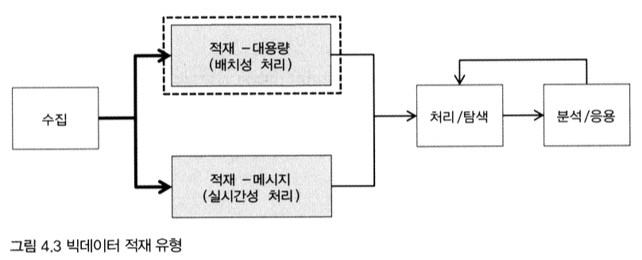

[출처: 실무로 배우는 빅데이터 기술, 김강원 저]

<br>

# 1. 빅데이터 적재 개요

- CH03에서 수집한 데이터를 어디에, 어떻게 저장할 것인가
- 수집한 데이터의 특징에 따라 처리 방식과 적재 위치가 달라질 수 있음

<br>

- 데이터 발생 주기에 따라 **일괄 배치성 데이터**인지, **실시간 스트림 데이터**인지
- 데이터 형식에 따라 가공 처리나 사전 검증 작업을 할 것인지
- 적재한 데이터를 어떤 비즈니스 요건에서 활용하느냐에 따라 적재 대상 위치가 달라질 수도 있음 -> 분산 파일, NoSQL, 메모리 캐시 등으로 구분해서 저장




<br>

- 적재는 빅데이터 시스템의 중심에 위치해 중요한 만큼, 관련 SW가 다양하면서 기술 복잡도도 매우 높음
- CH04에서는 일 단위로 만들어지는 스마트카의 상태 정보 로그 파일(약 100MB) 적재
- CH05에서는 스마트카 운전자의 실시간 운행 정보인 실시간 로그(약 4K/1건) 분석 적재

<br>

- 이번 장에서는 대용량 로그 파일의 적재 다룸

<br>

# 2. 하둡
## 1) 하둡 소개
- 빅데이터의 에코시스템들은 대부분 하둡을 위해 존재하고 하둡에 의존해서 발전해 가고 있다해도 과언이 아닐 정도로 빅데이터의 핵심 소프트웨어임
- 하둡의 두 가지 기능
    - 대용량 데이터 분산 저장
    - 분산 저장된 데이터를 가공/분석 처리

## 2) 하둡의 맵리듀스
 - 분산 병렬 처리에서의 핵심
    - 여러 컴퓨터에 분산 저장되어 있는 데이터로부터 어떻게 효율적으로 일을 나눠서 실행시킬 수 있느냐
    - 여러 컴퓨터가 나눠서 실행한 결과들을 어떻게 하나로 모으냐
- 이를 쉽고 편리하게 지원하는 프레임워크: **하둡의 맵리듀스(MapReduce)**
- 분산 컴퓨팅 기술을 이해하는 중요한 열쇠

<br>

   

```
1) 고객정보가 담긴 1GB의 파일을 100MB 파일 10개로 나눠서 10대의 서버(하둡 데이터노드)에 분산 저장 (나눠진 100MB 파일을 블록 파일이라 부르며, 일반적으로 128MB 블록 단위로 처리)
2) 전체 고객정보에서 VIP 고객의 평균 연봉 조회 쿼리 실행 -> 10대의 서버에 분산 저장된 100MB의 고객정보 파일로부터 Map 프로그램이 각각 생성
3) 실행된 Map 프로그램은 100MB의 고객정보 파일에서 VIP 고객정보만 추출한 후, 작아진 파일(2~8MB) 크기로 Server-11(Reduce)로 전송
4) Server-11에서 Reduce 프로그램이 실행되어 Server-01(Map01) ~ Server-10(Map02)이 전송한 VIP 고객정보를 merge(50MB)해 평균을 구하고 결과 파일(1KB) 생성
```

<br>

- 1~4의 과정은 대용량 데이터에 대한 처리를 여러 대의 서버들이 나누어 작업함으로써 한 대의 고성능 서버가 처리하기 힘든 작업을 신속하게 처리
- 맵리듀스 프로그램에서는 내부적으로 Split, Spill, Sort, Partition, Fetch, Shuffle, Merge 등 다양한 메커니즘들이 작동하며, 이 과정을 잘 이해하고 있어야 분산 환경에서 발생하는 다양한 문제에 빠르게 대처할 수 있음

<br>

## 3) 하둡의 기본 요소
|구성요소|설명|
|---|---|
|DataNode | 블록(64MB / 128MB 등) 단위로 분할된 대용량 파일들이 DataNode의 디스크에 저장 및 관리|
|NameNode | DataNode에 저장된 파일들의 메타 정보를 메모리 상에서 로드해서 관리|
|EditsLog | 파일들의 변경 이력(수정, 삭제 등) 정보가 저장되는 로그 파일|
|FsImage | NameNode의 메모리 상에 올라와 있는 메타 정보를 스냅샷 이미지로 만들어 생성한 파일|
|[Ver.1.x] SecondaryNameNode | NameNode의 FsImage와 EditsLog 파일을 주기적으로 유지 관리해주는 체크포인팅 노드|
|[Ver.1.x] MapReduce v1 | DataNode에 분산 저장된 파일이 스플릿(Map)되어 다양한 연산을 수행한 뒤, 그 결과를 다시 병합(Reduce)하는 분산 프로그래밍 기법|
|[Ver.1.x] JobTracker | 맵리듀스의 job을 실행하면서 태스크에 할당하고, 전체 job에 대해 리소스 분배 및 스케줄링|
|[Ver.1.x] TaskTracker | JobTracker가 요청한 맵리듀스 프로그램이 실행되는 태스크 <br> 이때 맵 태스크와 리듀스 태스크가 생성됨 | 
|[Ver.2.x] Active/Stand-By NameNode | NameNode를 이중화하여 서비스 중인 Active NameNode와 실패 처리를 대비한 Standby NameNode로 구성 | 
|[Ver.2.x] MapReduce v2 / YARN | 하둡 클러스터 내의 자원을 중앙 관리하고, 그 위에 다양한 애플리케이션을 실행 및 관리가 가능하도록 확장성과 호환성을 높인 하둡 2.x의 플랫폼|
|[Ver.2.x] ResourceManager | 하둡 클러스터 내의 자원을 중앙 관리하면서, 작업 요청시 스케줄링 정책에 따라 자원을 분배해서 실행시키고 모니터링 | 
|[Ver.2.x] NodeManager | 하둡 클러스터의 DataNode마다 실행되면서 Container를 실행시키고 라이프 사이클을 관리 | 
|[Ver.2.x] Container | DataNode의 사용 가능한 리소스를 Container 단위로 할당해서 구성 | 
|[Ver.2.x] ApplicationManager | 애플리케이션이 실행되면 생성됨 <br> NodeManager에게 애플리케이션이 실행될 Container를 요청하고, 그 위에서 애플리케이션 실행 및 관리|
|[Ver.2.x] JournalNode | 3개 이상의 노드로 구성되어 EditsLog를 각 노드에 복제 관리 <br> Active NameNode는 EditsLog에 쓰기만을 수행하고, Standby NameNode는 읽기만을 실행 |

<br>

## 4) 하둡 아키텍처

#### 1) 하둡 1.x 버전   
   

- 클라이언트에서 하둡에 파일 읽기/쓰기를 할 때는 우선 NameNode를 참조해서 파일읅 읽기/쓰기 할 DataNode 정보 전달받음
- 클라이언트는 해당 정보를 이용해 DataNode에 직접 연결하여 파일 읽기/쓰기
- 하둡에 적재된 데이터를 분석해야 할 때는 클라이언트가 JobTracker에게 맵리듀스 실행 요청
- JobTracker가 스케줄링 정책에 따라 작업할 DataNode / TaskTracker 선정

<br>

- 선정된 TaskTracker에 맵리듀스 프로그램이 전달되어 저장된 파일들을 이용해 맵리듀스 작업 실행됨
- 하지만, 하둡 1.x 아키텍처에는 여러 문제점이 있는데, 그중 하나가 NameNode의 이중화 기능 미지원으로 SPOF가 존재한다는 점
    - `SPOF` (단일 고장점) : 시스템 구성 요소 중에서 동작하지 않으면 전체 시스템이 중단되는 요소
    - 하둡에서 SPOF는 NameNode
    - NameNode가 정상적으로 작동하지 않으면 모든 클라이언트가 HDFS에 접근 불가 -> 모든 작업이 중지되고 파일을 읽거나 쓸 수 없게 됨
    - NameNode 파일 시스템 이미지에 HDFS의 디렉터리 구조와 파일 위치가 저장되어 있기 때문에, 문제가 생기면 블록에 접근할 수 있는 통로가 사라짐
    
#### 2) 하둡 2.x 버전


<br>

- 1.x 아키텍처의 문제점을 개선하기 위한 다양한 컴포넌트 교체 및 추가
- 클라이언트가 DataNode로부터 파일을 읽고 쓰기 전에 NameNode를 참조하게 되는데, 이때 1.x 버전과 다르게 `Active`/`Standby`로 이중화 되어있음을 알 수 있음
- 또한, NameNode의 메모리에서 관리되는 파일들의 네임스페이스 정보를 주기적으로 관리하기 위해 `JournalNode`가 추가되었고, `주키퍼`까지 사용됨

<br>

- 가장 큰 변화는 JobTracker, TaskTracker 대신 `Resource Manager`, `Node Manager`가 생긴 것
- `Resource Manager`는 Node Manager의 리소스 현황들을 종합적으로 수집해가며 작업 실행을 위한 최적의 DataNode를 찾아주어 효율적인 잡 스케줄링 가능해짐 <br>
\+ 1.x에서 발생했던 DataNode의 리소스 불균형 현상 문제도 해결
- `NodeManager`의 Container, Application Master는 1.x의 맵리듀스 잡 외에도 다양한 애플리케이션을 DataNode에서 실행 및 관리할 수 있게 확장됨
- 이렇게 변화된 하둡 2.x 플랫폼을 `YARN`이라고 함

<br>

## 5) 하둡 활용 방안
