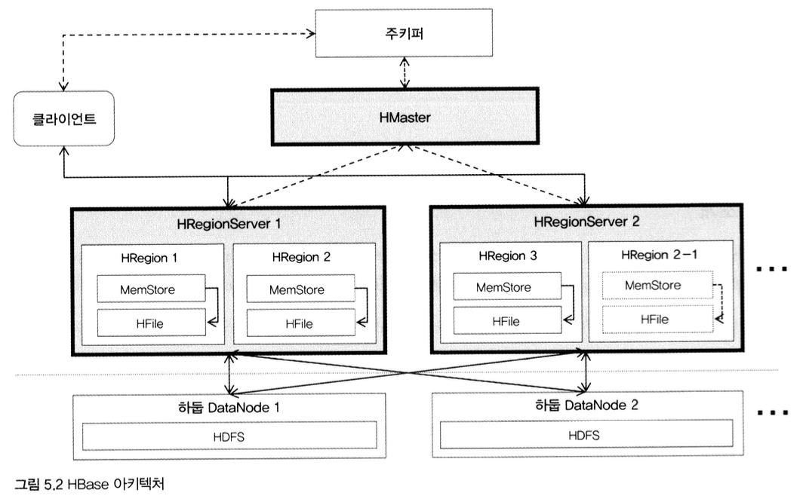
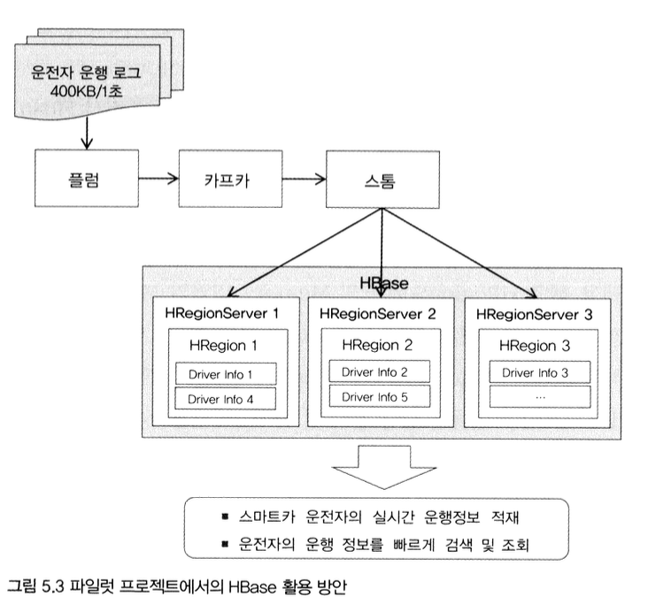
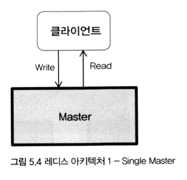
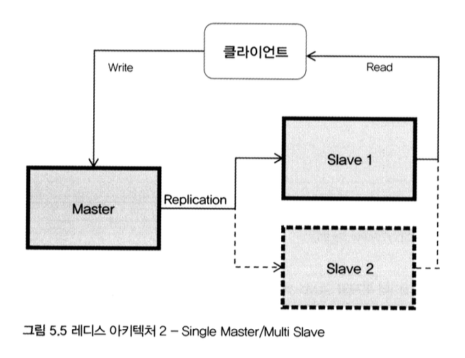
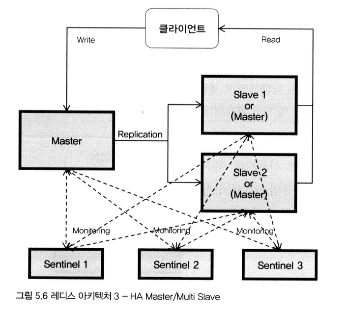
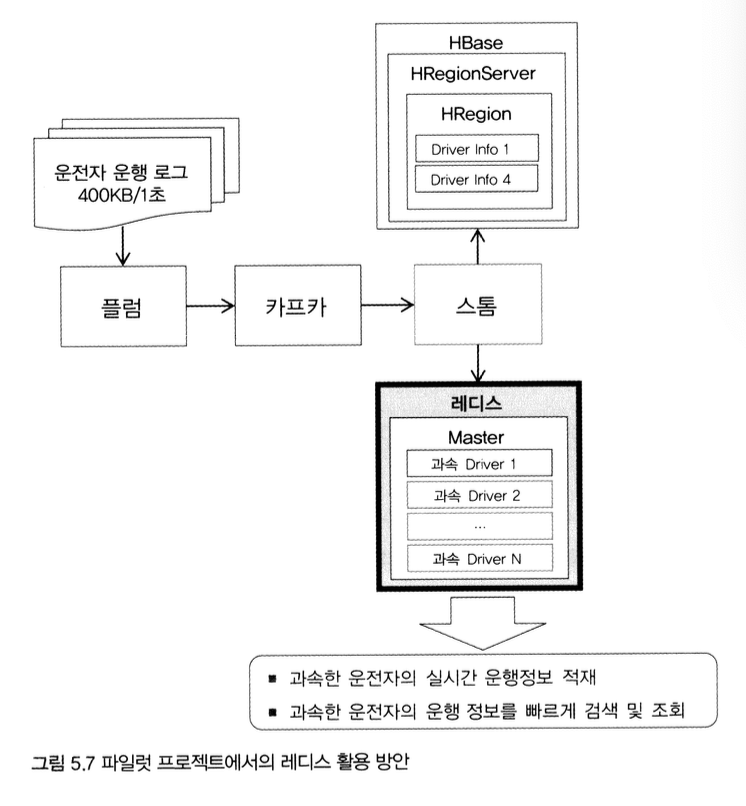

[출처: 실무로 배우는 빅데이터 기술, 김강원 저]

 

# 1. 빅데이터 실시간 적재 개요

- 앞장에 이어서 이번에는 스마트카 운전자의 실시간 운행 정보를 분석한 후 적재하는 영역 다룸
- **실시간 로그 분석**에는 작지만 대량으로 발생하는 메시지성 데이터를 실시간으로 분석 처리하며, 해당 결과를 인메모리에 저장해 주변 시스템과 빠르게 공유함
- 이때 대량의 메시지 데이터를 영구 저장하기 위해 하둡을 직접 이용하지는 않음
- 유입된 작은 메시지 한 건을 바로 하둡에 저장할 경우 한 개의 HDFS 파일이 생성되는데, 초당 수천 건의 트랜잭션이 발생하는 메시지의 경우 파일 개수가 기하급수적으로 늘어나고, 이로 인해 하둡 클러스터에 지나친 오버헤드가 발생하기 때문
- 중간에 메시지를 특정 크기로 모았다가 한번에 적재하거나, 대규모 트랜잭션 데이터를 처리하는 데 최적화된 칼럼 지향형 NoSQL DB 주로 이용

 

# 2. HBASE
## 1) HBASE 소개
- 하둡 기반의 칼럼 지향 NoSQL 데이터베이스
- 스키마 변경이 자유롭고, `리전`이라는 수십~수백 대의 분산 서버로 **샤딩**과 **복제**등의 기능을 지원해 성능과 안정성을 보장하는 특징을 가짐 
- 특히 하둡의 확장성과 내고장성을 그대로 이용할 수 있어 대규모 실시간 데이터 처리를 위한 스피트 레이어 저장소에 주로 사용됨

 

## 2) 주요 구성 요소
|주요 구성 요소 | 설명|
|---|---|
|HTable | 칼럼 기반 데이터 구조를 정의한 테이블   공통점이 있는 칼럼들의 그룹을 묶은 **칼럼 패밀리**와 테이블의 로우를 식별해서 접근하기 위한 **로우키**로 구성 |
|HMaster | HRegion 서버를 관리하며, HRegion들이 속한 HRegion 서버의 메타 정보 관리|
|HRegion | HTable의 크기에 따라 자동으로 수평 분할이 발생하고, 이때 분할된 블록을 HRegion 단위로 지정|
|HRegionServer | 분산 노드별 HRegionServer가 구성되며, 하나의 HRegionServer에는 다수의 HRegion이 생성되어 HRegion 관리|
|Store | 하나의 Store에는 칼럼 패밀리가 저장 및 관리되며, MemStore와 HFile로 구성됨 | 
|MemStore | Store 내의 데이터를 인메모리에 저장 및 관리하는 데이터 캐시 영역|
|HFile | Store 내의 데이터를 스토리지에 저장 및 관리하는 영구 저장 영역|

 

## 3) HBase 아키텍처
- 가장 큰 특징은 하둡의 **HDFS**를 기반으로 설치 및 구성된다는 것
- 그로 인해 **분산 데이터베이스 아키텍처**를 채택하고 있으며,
- HDFS의 가용성과 확장성을 그대로 물려받음

 

- **클라이언트가 HBase에 데이터를 저장(put)하는 과정**

- 클라이언트가 HBase 테이블에 특정 데이터를 저장하기 전, 주키퍼를 통해 HTable의 기본 정보와 해당 HRegion의 위치 정보를 알아냄
- 해당 정보를 기반으로 클라이언트가 직접 HRegionServer로 연결되어 HRegion의 Memory 영역인 MemStore에 데이터 저장
- 이때 MemStore에 저장된 데이터는 특정 시점이 되면 HFile로 HDFS에 플러시(Flush)되고, HFile은 HRegion의 상황에 따라 최적의 HFile로 재구성되는 작업이 이루어짐
- 이러한 플러시 과정들을 HBase에서는 `Minor/Major Compaction`이라고 함

 

- **HBase에서 특정 데이터를 가져오는 과정**
- 주키퍼를 통해 로우키(RowKey)에 해당하는 데이터의 위치 정보를 알아냄
- 해당 HRegionServer의 Memory 영역인 MemStore에서 데이터를 가져옴으로써 디스크 I/O를 최소화하면서 빠른 응답 속도 보장
- 만일 데이터가 MemStore에서 플러시되어 존재하지 않으면 HFile 영역으로 이동해 데이터 찾게 되는데, 이때 HBase와 HDFS 사이의 모든 데이터 스트림 라인들은 항상 열려있으므로 레이턴시가 발생하지 않음    
(레이턴시: 시간 지연, 하나의 데이터 패킷을 한 지점에서 다른 지점으로 보내는데 소요되는 시간)

 

## 4) HBase 활용 방안
   
- 앞서 CH03에서 Flume을 이용해 수집한 스마트카 운전자의 운행 정보를 Kafka까지 전송했음
- 이번 장에서는 Kafka에 저장되어 있는 데이터를 Storm이 받아서 HBase의 테이블에 모두 적재
- 또한, HBase에 저장된 스마트카 운전자의 운행 정보를 특정 조건에 따라 필터링해서 신속하게 조회해 보고, 하이브 핸들러를 이용해 HBase에 저장된 데이터와 하이브 데이터를 동시에 활용해봄

 

# 3. Redis
## 1) 레디스 소개
- 분산 캐시 시스템이면서, NoSQL DB처럼 대규모 데이터 관리 능력도 갖춘 IMDG(In-Memory Data Grid) 소프트웨어
- 키/값 형식의 데이터 구조를 분산 서버 상의 메모리에 저장하면서 고성능의 응답 속도 보장
- 다양한 데이터 타입을 지원하기 때문에 데이터를 구조화해서 저장할 수 있어, 단순 키/값 이상의 데이터 복잡성도 처리할 수 있음
- 인메모리 데이터를 영구적으로 저장할 수 있는 스냅샷 기능 제공
- 데이터의 유실에 대비해 AOF(Append Only File) 기능으로 정합성 보장
- NoSQL의 특징인 데이터의 샤딩과 복제도 지원하여 높은 성능이 필요한 서비스에서 많이 사용됨

 

## 2) 주요 구성 요소
|주요 구성 요소|설명|
|---|---|
|Master|분산 노드 간의 데이터 복제와 Slave 서버의 관리를 위한 Master 서버|
|Slave|다수의 Slave 서버는 주로 읽기 요청을 처리하고, Master 서버는 쓰기 요청을 처리|
|Sentinel|레디스 3.x부터 지원하는 기능으로, Master 서버에 문제가 발생할 경우 새로운 Master를 선출하는 기능|
|Replication|Master 서버에 쓰인 내용을 Slave 서버로 복제해서 동기화 처리|
|AOF / Snapshot| 데이터를 영구적으로 저장하는 기능으로, 명령어를 기록하는 AOF와 스냅샷 이미지 파일 방식 지원|

 

## 3) 레디스 아키텍처
- 3.x에서부터 HA 기능이 강화되면서 클러스터의 완성도가 높아짐
- 요구사항과 데이터의 샤딩 및 복제 구성 방식에 따라 세가지 아키텍처 구성 가능

 

#### 1) 레디스 아키텍처 1

- Single Master 형식
- 개발과 테스트 환경에 주로 사용됨
- 설치하기가 쉽고 단일 서버만으로도 빠른 응답 속도와 안정적인 기능을 제공함으로써 소규모이면서 중요도가 비교적 낮은 시스템 간의 데이터 공유에도 종종 사용됨

 

#### 2) 레디스 아키텍처 2

- Single Master / Multi Slave 형식
- Master에 쓰여진 데이터는 복제를 통해 Slave 노드로 복제되면서 데이터 정합성 유지
- 쓰기 / 읽기 노드를 분리해서 전체적인 성능을 향상시킨 구성
- Slave 2와 같이 읽기 노드를 추가해서 성능을 극대화할 수 있음

 

#### 3) 레디스 아키텍처 3

- 버전 3.x부터 지원되는 HA 클러스터링 구조
- 아키텍처 2는 두가지 문제점이 있음
    - Master 서버 장애 발생 시 쓰기 요청이 실패하면서 데이터 유실이 발생할 수 있는 취약한 구조
    - 클라이언트가 쓰기 노드와 읽기 노드를 알고 있으야 하므로 클라이언트 프로그램에 복잡도 발생
- 이러한 문제점 극복을 위해 `Sentinel`이라는 노드 모니터링/제어 컴포넌트 추가
- Sentinel이 노드들을 모니터링하고 있다가, Master 서버에 문제가 발생하면 Slave 노드 중 하나를 Master 노드로 지정하고, 문제가 됐던 Master 노드와 연결을 끊으면서 HA 기능 제공

 

## 4) 레디스 활용 방안

- 스마트카 운전자의 상태 정보를 실시간으로 분석
- 분석한 결과를 빠르게 저장하면서 주변 시스템과 공유하기 위한 저장소로 레디스 활용
- 위의 그림에서 Storm에서 두 개의 경로로 분리되는 것을 볼 수 있음
    - HBase에는 운전자의 모든 상태 정보를 저장
    - 레디스에는 운전자의 특정 패턴을 감지한 이벤트 결과(과속한 운전자 정보)만 저장
- 그러면 주변 응용 시스템에서 레디스에 적재된 정보를 빠르게 조회해서 활용하게 됨

 

# 4. Storm
## 1) 스톰 소개
- 스피드 데이터를 인메모리 상에서 병렬 처리하기 위한 소프트웨어
- 스피드 데이터는 원천 시스템의 수많은 이벤트가 만들어내며, 작지만 대규모의 동시다발적이라는 특성이 있음
- 이러한 스피드 데이터를 실시간으로 다루기 위해 모든 데이터를 인메모리 상에서 분산 병렬 처리하고, 분산 데이터를 통제하기 위한 강력한 기능(분리, 정제, 통합, 집계 등)과 아키텍처 제공

 

