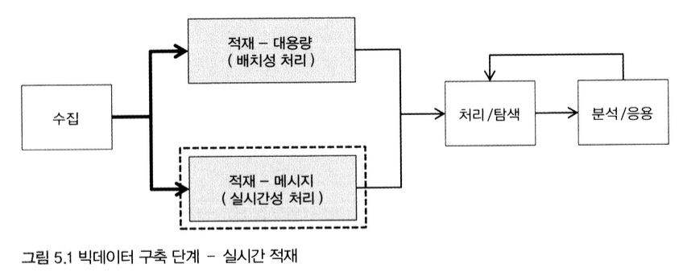

[출처: 실무로 배우는 빅데이터 기술, 김강원 저]

 

# 1. 빅데이터 실시간 적재 개요

- 앞장에 이어서 이번에는 스마트카 운전자의 실시간 운행 정보를 분석한 후 적재하는 영역 다룸
- **실시간 로그 분석**에는 작지만 대량으로 발생하는 메시지성 데이터를 실시간으로 분석 처리하며, 해당 결과를 인메모리에 저장해 주변 시스템과 빠르게 공유함
- 이때 대량의 메시지 데이터를 영구 저장하기 위해 하둡을 직접 이용하지는 않음
- 유입된 작은 메시지 한 건을 바로 하둡에 저장할 경우 한 개의 HDFS 파일이 생성되는데, 초당 수천 건의 트랜잭션이 발생하는 메시지의 경우 파일 개수가 기하급수적으로 늘어나고, 이로 인해 하둡 클러스터에 지나친 오버헤드가 발생하기 때문
- 중간에 메시지를 특정 크기로 모았다가 한번에 적재하거나, 대규모 트랜잭션 데이터를 처리하는 데 최적화된 칼럼 지향형 NoSQL DB 주로 이용

 

# 2. HBASE
## 1) HBASE 소개
- 하둡 기반의 칼럼 지향 NoSQL 데이터베이스
- 스키마 변경이 자유롭고, `리전`이라는 수십~수백 대의 분산 서버로 **샤딩**과 **복제**등의 기능을 지원해 성능과 안정성을 보장하는 특징을 가짐 
- 특히 하둡의 확장성과 내고장성을 그대로 이용할 수 있어 대규모 실시간 데이터 처리를 위한 스피트 레이어 저장소에 주로 사용됨

 

## 2) 주요 구성 요소
|주요 구성 요소 | 설명|
|---|---|
|HTable | 칼럼 기반 데이터 구조를 정의한 테이블   공통점이 있는 칼럼들의 그룹을 묶은 **칼럼 패밀리**와 테이블의 로우를 식별해서 접근하기 위한 **로우키**로 구성 |
|HMaster | HRegion 서버를 관리하며, HRegion들이 속한 HRegion 서버의 메타 정보 관리|
|HRegion | HTable의 크기에 따라 자동으로 수평 분할이 발생하고, 이때 분할된 블록을 HRegion 단위로 지정|
|HRegionServer | 분산 노드별 HRegionServer가 구성되며, 하나의 HRegionServer에는 다수의 HRegion이 생성되어 HRegion 관리|
|Store | 하나의 Store에는 칼럼 패밀리가 저장 및 관리되며, MemStore와 HFile로 구성됨 | 
|MemStore | Store 내의 데이터를 인메모리에 저장 및 관리하는 데이터 캐시 영역|
|HFile | Store 내의 데이터를 스토리지에 저장 및 관리하는 영구 저장 영역|