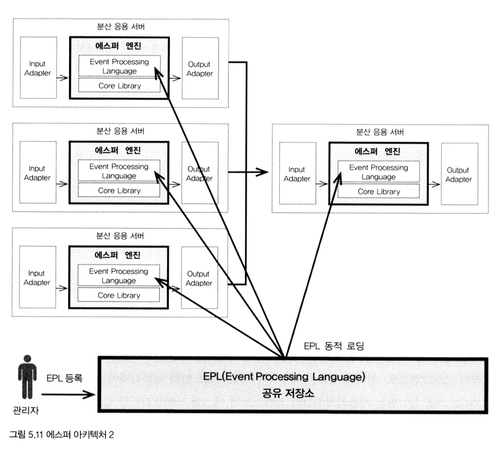
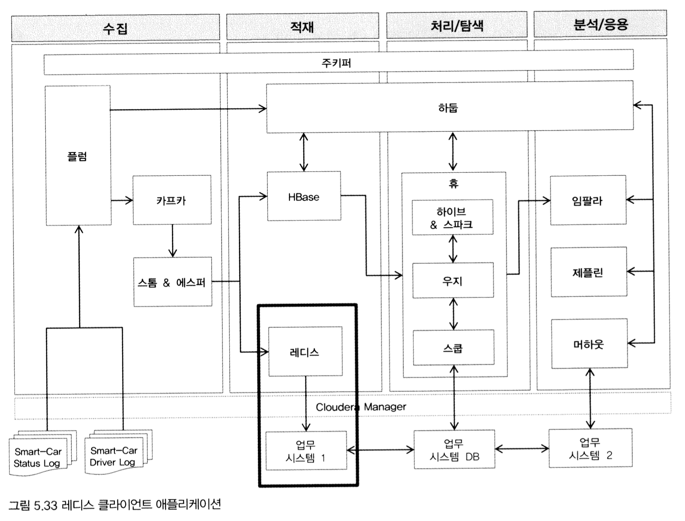

# 1. 실시간 적재 환경 구성
## 1) HBase 설치
- CM 홈 - [서비스 추가] - [HBase] 선택 - [계속]


<br>

- HBase의 Master와 RegionServer 설치 위치 지정
- Server01, Server02만 있는 상태이므로, 모든 설치 위치를 Server02로 지정
- 추기로 Thrift Server는 Server01에 설치하며, REST 서버는 사용하지 않음


<br>

- HBase Service의 기본 설정값 변경
- HBase의 테이블 복제 및 인덱스는 사용하지 않음
- 기본값을 유지하고 [계속] 클릭

<br>

- HBase의 Thrift Http 서버 활성화
- CM 홈 - [HBase] - [구성]
- "HBase Thrift Http 서버 설정" 검색
- **HBase(서비스 전체)** 항목 체크 후 [변경 내용 저장]


<br>

- HBase 서비스 시작 또는 재시작
- 그럼 HBase의 Master 서버와 RegionServer 기동 화면이 활성화될 것
- HBase처럼 규모가 있는 컴포넌트가 설치되면 이미 설치된 소프트웨어(주키퍼, HDFS, YARN 등)의 클라이언트 설정값에 변동 발생 -> 클라이언트 재배포를 통해 변경사항 반영

<br>

- HBase가 정상적으로 설치되었는지 확인하기 위해 HBase 쉘에서 테스트용 테이블을 만들고, 해당 테이블에 Put / Get 명령 실행
```bash
hbase shell
> create 'smartcar_test_table', 'cf'
> put 'smartcar_test_table', 'row-key1', 'cf:model', 'Z0001'
> put 'smartcar_test_table', 'rew-key1', 'cf:no', '12345'
> get 'smartcar_test_table', 'row-key1'
```


```bash
# table 삭제
> disable 'smartcar_test_table'
> drop 'smartcar_test_table'
> exit
```


<br>

- HBase 웹 관리자 화면에 접속하면 HBase의 다양한 상태를 모니터링할 수 있음   
http://server02.hadoop.com:16010


<br>

- HBase는 자원 소모가 높은 서버이므로 사용하지 않을 때는 일시 정지

<br>

## 2) 레디스 설치
- CM의 소프트웨어 컴포넌트로 포함되어 있지 않기 때문에 레디스 설치 패키지로 Server02에 직접 설치

<br>

- Server02에 root 계정으로 로그인
- **gcc**와 **tcl** 설치

```bash
yum install -y gcc*
yum install -y tcl
```

> yum 명령 중 "removing mirrorlist with no valid mirrors:.." 에러가 발생하면 아래 명령 모두 실행
```bash
echo "http: //vault.centos.org/6.10/os/×86_64/" > /var/cache/yum/x86_64/6/base/mirrorlist.txt
echo "http://vault.centos.org/6.10/extras/x86_64/" > /var/cache/yum/×86_64/6/extras/mirrorlist.txt
echo "http://vault.centos.org/6. 10/updates/x86_64/" > /var/cache/yum/x86_64/6/updates/mirrorlist.txt
echo "http://vault.centos.org/6.10/sclo/x86_64/rh" › /var/cache/yum/×86_64/6/centos-sclo-rh/mirrorlist.txt 
echo "http://vault.centos.org/6.10/sclo/x86_64/sclo" >/var/cache/yum/×86_64/6/centos-sclo-sclo/mirrorlist.txt
```

<br>

- 레디스 5.0.7 다운받아 빌드 및 설치 진행
```bash
cd /home/pilot-pjt
wget http://download.redis.io/releases/redis-5.0.7.tar.gz
tar -xvf redis-5.0.7.tar.gz
cd /home/pilot-pjt/redis-5.0.7
make
make install
cd /home/pilot-pjt/redis-5.0.7/utils
chmod 75 install_server.sh
```


<br>

- 인스톨 스크립트 실행
- 여러 확인 메시지들 모두 엔터키 입력
```bash
./install_server.sh
```


<br>

- 레디스 인스턴스의 포트, 로그, 데이터 파일 등의 설정값 및 위치 정보를 물어보면 기본값을 그대로 유지하고 엔터키 입력
- 아래 `vi` 명령으로 레디스 서버 기동 여부 확인
```bash
vi /var/log/redis_6379.log
```


<br>

- 레디스가 성공적으로 설치됐는지 점검하기 위해 아래 명령 실행 후 `Redis is running` 메시지 확인
```bash
service redis_6379 status
```
> redis 서버 포트 기본값: 6379

- 레디스 서비스 시작 `service redis_6379 start`
- 레디스 서비스 종료 `service redis_6379 stop`

<br>

- 레디스 서버에 원격 접근을 하기 위해 설정 파일을 열어 아래와 같이 수정
- 설정 파일은 `/etc/redis/6379.conf`에 위치
```bash
vi /etc/redis/6379.conf
```

- 바인딩 IP 제한 해제
    - `bind 127.0.0.1` 부분 주석 처리
- 패스워드 입력 해제
    - `protected-mode yes` 부분을 찾아 **yes** -> **no** 로 변경


- 레디스 서버 재시작
```bash
service redis_6379 restart
```

<br>

- **레디스 CLI를 통해 간단히 레디스 서버에 데이터 저장(Set) / 조회(Get)**   
    - `key:1`이라는 키로 "Hello!BigData" 값을 레디스 서버에 저장하고 다시 조회
    - 마지막으로 `key:1`의 데이터 삭제하고 레디스 CLI 종료
```bash
redis-cli
> set key:1 Hello!BigData
> get key:1
> del key:1
> quit
```


<br>

## 3) 스톰 설치
- Server02에 root 계정으로 접속해서 스톰 설치를 위한 tar 파일 다운로드
```bash
cd /home/pilot-pjt
wget http://archive.apache.org/dist/storm/apache-storm-1.2.3/apache-storm-1.2.3.tar.gz
tar -xvf apache-storm-1.2.3.tar.gz
ln -s apache-storm-1.2.3 storm
```

<br>

- **스톰 환경설정 파일 수정**
- `storm.yaml` 파일 열어서 아래 내용과 동일하게 입력
```bash
cd /home/pilot-pjt/storm/conf
vi storm.yaml
```
```
storm.zookeeper.servers:
 - "server02.hadoop.com"

storm.local.dir: "/home/pilot-pjt/storm/data"

nimbus.seeds: ["server02.hadoop.com"]

supervisor.slots.ports:
 - 6700

ui.port: 8088
```


- 5개의 스톰 설정값
    - 주키퍼 정보
    - 스톰이 작동하는 데 필요한 데이터 저장소
    - 스톰의 Nimbus 정보
    - Worker의 포트로서, 포트의 개수만큼 멀티 Worker가 만들어짐
        - 파일럿 프로젝트에서는 6700번 포트의 단일 워커만 작동
    - 마지막으로 스톰 UI 접속 포트 설정

<br>

- **스톰의 로그 레벨 조정**
- 기본값인 "info"로 되어있는데, 스톰에서는 대규모 트랜잭션 데이터가 유입되면서 과도한 로그로 인해 성능 저하와 디스크 공간 부족이 발생할 수 있음
- 이 같은 문제르 방지하기 위해 두 개의 파일 수정
    - cluster.zml , worker.xml 파일
    - 75번째 줄과 91번째 줄 사이의  logger 설정에서 `level="info"` -> `level="error`로 모두 변경

```bash
cd /home/pilot-pjt/storm/long4j2
vi cluster.xml
vi worker.xml
```


<br>

- **root 계정의 프로파일의 스톰 path 설정**
```bash
vi /root/.bash_profile
```
- `/home/pilot-pjt/storm/bin` 경로 추가


- **수정한 root 계정의 프로파일 정보 다시 읽어옴**
```bash
source /root/.bash_profile
```

<br>

- CH02에서 설정했던 자바 명령의 링크 정보가 변경되는 경우가 있음
- `java -version`을 실행한 후, '1.8.x'가 아니면 아래 명령을 통해 JDK 1.8 링크로 변경
```bash
rm /usr/bin/java
rm /usr/bin/javac
ln -s /usr/java/jdk1.8.0_181-cloudera/bin/javac /usr/bin/javac
ln -s /usr/java/jdk1.8.0_181-cloudera/bin/java /usr/bin/java
```

<br>

- 기본적인 스톰 설치 완료
- 리눅스가 재시작할 때도 스톰이 자동으로 실행되도록 설정
- `storm-nimbus`, `storm-supervisor`, `storm-ui` 3개의 스톰 서비스가 있고, 3개의 자동 실행 스크립트 필요
- 파일질라 이용해서 sever02에 3개의 스크립트 생성


<br>

- **업로드한 세 파일의 권한 변경**
```bash
chmod 755 /etc/rc.d/init.d/storm-nimbus
chmod 755 /etc/rc.d/init.d/storm-supervisor
chmod 755 /etc/rc.d/init.d/storm-ui
```


<br>

- **서비스 등록 스크립트에 대한 Log 및 Pid 디렉터리 생성**
```bash
mkdir /var/log/storm
mkdir /var/run/storm
```


<br>

- **세 파일에 대해 아래의 service/chkconfig 등록 명령 각각 실행
```bash
  
```

<br>

- **아래 명령으로 스톰이 정상적으로 구동됐는지 확인**
```bash
service storm-nimbus status
service storm-supervisor status
service storm-ui status
```
- 모두 `...is running` 상태인지 확인
> 주의) 스톰은 주키퍼에 의존도가 높기 때문에, 스톰을 사용할 땐 반드시 주키퍼의 상태를 확인해야 함!

<br>

- 스톰 UI에 접속해서 스톰의 중요 상태들을 모니터링할 수 있음   
http://server02.hadoop.com:8088


<br>

# 2. 실시간 적재 기능 구현
- 스톰의 Spout과 Bolt의 프로그램 구현 단계
- 운전자의 운행 정보가 실시간으로 카프카에 적재되고, 이를 스톰의 Spout가 읽어서 Bolt로 전달
- 아래 그림은 파일럿 프로젝트에서 실시간 처리와 적재를 위한 스톰 Topology
- Topology 안의 5개 컴포넌트는 모두 자바 프로그램이며, 해당 프로그램을 통해 실시간 적재 기능 구현


<br>

> **용어 정리**   
> `table`: HBase는 데이터를 테이블에 조직화. 여러 개의 로우로 구성된 집합     
> `row`: 테이블 내에 있고, 데이터는 테이블의 로우에 따라 저장됨. 로우는 로우키와 한 개 이상의 칼럼과 값으로 구성됨.    
> `row key`: 로우는 로우키에 의해 유일하게 식별됨     
> `column`: HBase 칼럼은 column family와 column qualifier로 구성됨   
> `칼럼 패밀리`: 로우 내에 있는 데이터는 칼럼 패밀리에 의해 그룹화됨. 또한, HBase 내의 데이터 저장을 위한 물리적 처리 방식에 영향을 줌.    


<br>

## 1) 카프카 Spout 기능 구현
- 스톰 Spout의 기본 기능은 외부 시스템과의 연동을 통해 스톰의 Topology로 데이터를 가져오는 것
- 파일럿 플젝에서는 카프카에 적재된 데이터를 가져오기 위해 **카프카-Spout**을 사용
- 카프카 Spout은 카프카로부터 수신받은 데이터를 두 개의 Bolt(Split/Esper)에 라우팅

<br>

- **카프카 Spout 생성 - SmartCarDriverTopology.java**
```java
package com.wikibook.bigdata.smartcar.storm;

import java.io.IOException;
import java.util.Arrays;
import java.util.Map;
import java.util.UUID;

import org.apache.storm.guava.collect.Maps;
import org.apache.storm.redis.common.config.JedisPoolConfig;

import storm.kafka.BrokerHosts;
import storm.kafka.KafkaSpout;
import storm.kafka.SpoutConfig;
import storm.kafka.StringScheme;
import storm.kafka.ZkHosts;
import backtype.storm.Config;
import backtype.storm.StormSubmitter;
import backtype.storm.generated.AlreadyAliveException;
import backtype.storm.generated.InvalidTopologyException;
import backtype.storm.generated.StormTopology;
import backtype.storm.spout.Scheme;
import backtype.storm.spout.SchemeAsMultiScheme;
import backtype.storm.topology.TopologyBuilder;

public class SmartCarDriverTopology {


	public static void main(String[] args) throws AlreadyAliveException, InvalidTopologyException, InterruptedException, IOException {  

		StormTopology topology = makeTopology();

		Map<String, String> HBaseConfig = Maps.newHashMap();
		HBaseConfig.put("hbase.rootdir","hdfs://server01.hadoop.com:8020/hbase");

		Config config = new Config();
		config.setDebug(true);
		config.put("HBASE_CONFIG",HBaseConfig);

		config.put(Config.NIMBUS_HOST, "server01.hadoop.com");
		config.put(Config.NIMBUS_THRIFT_PORT, 6627);
		config.put(Config.STORM_ZOOKEEPER_PORT, 2181);
		config.put(Config.STORM_ZOOKEEPER_SERVERS, Arrays.asList("server02.hadoop.com"));

		StormSubmitter.submitTopology(args[0], config, topology);
	}  

	private static StormTopology makeTopology() {
        
        // ⓵
		String zkHost = "server02.hadoop.com:2181";
		TopologyBuilder driverCarTopologyBuilder = new TopologyBuilder();
		
		// Spout Bolt
		BrokerHosts brkBost = new ZkHosts(zkHost);
		String topicName = "SmartCar-Topic";
		String zkPathName = "/SmartCar-Topic";

        // ⓶
		SpoutConfig spoutConf = new SpoutConfig(brkBost, topicName, zkPathName, UUID.randomUUID().toString());
		spoutConf.scheme = new SchemeAsMultiScheme(new StringScheme());
		KafkaSpout kafkaSpout = new KafkaSpout(spoutConf);
		
        // ⓷
		driverCarTopologyBuilder.setSpout("kafkaSpout", kafkaSpout, 1);
		
        // ⓸
		// Grouping - SplitBolt & EsperBolt
		driverCarTopologyBuilder.setBolt("splitBolt", new SplitBolt(),1).allGrouping("kafkaSpout");
		driverCarTopologyBuilder.setBolt("esperBolt", new EsperBolt(),1).allGrouping("kafkaSpout");
		
		// HBase Bolt
		TupleTableConfig hTableConfig = new TupleTableConfig("DriverCarInfo", "r_key");
		hTableConfig.setZkQuorum("server02.hadoop.com");
		hTableConfig.setZkClientPort("2181");
		hTableConfig.setBatch(false);
		hTableConfig.addColumn("cf1", "date");
		hTableConfig.addColumn("cf1", "car_number");
		hTableConfig.addColumn("cf1", "speed_pedal");
		hTableConfig.addColumn("cf1", "break_pedal");
		hTableConfig.addColumn("cf1", "steer_angle");
		hTableConfig.addColumn("cf1", "direct_light");
		hTableConfig.addColumn("cf1", "speed");
		hTableConfig.addColumn("cf1", "area_number");
		
		HBaseBolt hbaseBolt = new HBaseBolt(hTableConfig);
		driverCarTopologyBuilder.setBolt("HBASE", hbaseBolt, 1).shuffleGrouping("splitBolt");
		
		// Redis Bolt
		String redisServer = "server02.hadoop.com";
		int redisPort = 6379;
		JedisPoolConfig jedisPoolConfig = new JedisPoolConfig.Builder().setHost(redisServer).setPort(redisPort).build();
		RedisBolt redisBolt = new RedisBolt(jedisPoolConfig);
		
		driverCarTopologyBuilder.setBolt("REDIS", redisBolt, 1).shuffleGrouping("esperBolt");

		return driverCarTopologyBuilder.createTopology();
	}
}  
```

- ⓵
    - 카프카에 접속하기 위한 서버와 토픽 정보를 정의
    - KafkaSpout이 작동하는 Worker의 구성 정보 설정
- ⓶
    - KafkaSpout 객체 생성
    - 주키퍼 서버 정보, 카프카 토픽 정보, 메시지 형식, 메시지 수신 방식 등 설정
- ⓷
    - KafkaSpout 객체를 스톰의 Topology에 설정
    - '고유 ID', 'Kafka Spout 객체, '병렬 처리 힌트' 설정
- ⓸
    - KafkaSpout가 수신받은 데이터를 어떻게 라우팅할지에 대한 설정
    - 스톰 Topology의 그루핑 설정으로 All-Grouping 기능을 이용해 앞서 설정한 "KafkaSpout"로부터 받은 데이터를 두 개의 Bolt(Split/Esper)에 동일하게 전달

<br>

## 2) Split Bolt 기능 구현
- Split Bolt는 카프카-Spout으로부터 전달받은 메시지를 HBase의 칼럼 필드 단위로 분리하기 위한 작업 수행

<br>

- **Split Bolt 소스 - SplitBolt.java**
```java
package com.wikibook.bigdata.smartcar.storm;

import backtype.storm.topology.BasicOutputCollector;
import backtype.storm.topology.OutputFieldsDeclarer;
import backtype.storm.topology.base.BaseBasicBolt;
import backtype.storm.tuple.Fields;
import backtype.storm.tuple.Tuple;
import backtype.storm.tuple.Values;


public class SplitBolt extends BaseBasicBolt{

	private static final long serialVersionUID = 1L;

	public void execute(Tuple tuple, BasicOutputCollector collector) {

		String tValue = tuple.getString(0);  

        // ⓵
        // 발생일시(14자리), 차량번호, 가속페달, 브레이크페달, 운전대회적각, 방향지시등, 주행속도, 뮤직번호
		String[] receiveData = tValue.split("\\,");
		
        // ⓶
		collector.emit(new Values(	new StringBuffer(receiveData[0]).reverse() + "-" + receiveData[1]  , 
									receiveData[0], receiveData[1], receiveData[2], receiveData[3],
									receiveData[4], receiveData[5], receiveData[6], receiveData[7]));

	}

	public void declareOutputFields(OutputFieldsDeclarer declarer) {
        // ⓷
		declarer.declare(new Fields("r_key"			, "date"		, "car_number", 
									"speed_pedal"	, "break_pedal"	, "steer_angle", 
									"direct_light"	, "speed"		, "area_number"));
	}

}
```

- ⓵
    - KafkaSpout에서 전달한 데이터가 튜플 형식으로 수신됨
    - 그리고 튜플에 들어있는 데이터를 `,` 단위로 분리해서 배열에 담음
    - 스톰의 메시지 단위 하나를 **튜플**이라고 하는데, 각 스톰의 레이어 간(Spout -> Bolt, Bolt -> Bolt 등) 메시지 전달 단위로 생각하면 됨
- ⓶
    - 스마트카 운전자의 실시간 운행 정보 데이터셋의 형식 정의
    - 해당 데이터를 배열로 구조화하고, 데이터를 다음 단계로 전송
    - 빅데이터의 비정형 로그 데이터가 정형 데이터로 변환되는 과정으로 볼 수 있음
- ⓷
    - ⓶에서 설정한 9개의 값과 순서별로 일치하는 필드명은 다음과 같음
    - **r_key**: HBase 테이블에서 사용할 로우키
    - **date**: 운행 데이터 발생 일시
    - **car_num**: 스마트카의 고유 차량 번호
    - **speed_pedal**: 과속 페달 단계
    - **break_pedal**: 브레이크 페달 단계
    - **steer_angle**: 운전대 회전 각도
    - **direct_light**: 방향 지시등
    - **speed**: 차량 속도
    - **area**: 차량 운행 지역

<br>

- 여기서 **r_key**는 HBase 테이블에서 로우키로 활용되는 중요 필드로, `date + car_num`을 조합한 값
- 이때 `date`에는 타임스탬프를 **뒤집은 값**이 매핑됨
    - ex) '20160124134517' -> '71543152106102'
    - HBase에 데이터를 저장할 때 로우키의 HexString 값을 기준으로 저장할 Region을 결정하는 메커니즘 때문
    - 파일럿 플젝에서 사용할 로우키는 동일패턴 `20160125XXXXXX + 차량번호`의 값이 지속적으로 생성되며, 로우키의 유사 HexString 값이 만들어져 특정 Region으로만 부하가 집중되는 문제 발생
    - 핸드폰 번호(010-XXXX-XXXX)나 위치 정보(GPS, IP) 등을 로우키로 활용할 때도 주의해야 함)
    - 또한, Region은 특정 크기가 되면 자동 분할되는데, 이때 서비스가 일시 중단되는 현상이 발생하기도 함
    - 이 같은 문제를 방지하기 위해 
        - HBase 테이블을 생성할 때 사용할 Region을 미리 스플릿(Pre-Split)해서 여러 개의 RegionServer에 분리 생성해놓음
        - 데이터를 저장할 때 로우키를 리버스해 HexString 시작값을 다양하게 발생시킴
        - 여러 RegionServer로 부하를 분산시킴으로써 저장 속도 극대화
- 이와 같은 HBase 로우키 메커니즘은 데이터 설계 단계에서부터 중요하게 검토해야 할 사항!

<br>

## 3) HBase Bolt 기능 구현
- HBase Bolt는 스마트카 운전자의 모든 운행 데이터를 최종적으로 적재하는 기능 수행
- 앞서 Split Bolt가 분리한 필드명을 HBase의 테이블 칼럼명과 일치시켜 칼럼 단위로 저장
- HBase Bolt도 HBase의 데이터를 적재하기 위해 HBase에 연결된 **주키퍼의 연결 정보**가 필요하며, 저장하고자 하는 **테이블의 로우키**와 **칼럼 패밀리 정보**도 알고있어야 함

<br>

- **HBase Bolt 생성 - SmartCarDriverTopology.java**
```java
package com.wikibook.bigdata.smartcar.storm;

import java.io.IOException;
import java.util.Arrays;
import java.util.Map;
import java.util.UUID;

import org.apache.storm.guava.collect.Maps;
import org.apache.storm.redis.common.config.JedisPoolConfig;

import storm.kafka.BrokerHosts;
import storm.kafka.KafkaSpout;
import storm.kafka.SpoutConfig;
import storm.kafka.StringScheme;
import storm.kafka.ZkHosts;
import backtype.storm.Config;
import backtype.storm.StormSubmitter;
import backtype.storm.generated.AlreadyAliveException;
import backtype.storm.generated.InvalidTopologyException;
import backtype.storm.generated.StormTopology;
import backtype.storm.spout.Scheme;
import backtype.storm.spout.SchemeAsMultiScheme;
import backtype.storm.topology.TopologyBuilder;

public class SmartCarDriverTopology {


	public static void main(String[] args) throws AlreadyAliveException, InvalidTopologyException, InterruptedException, IOException {  

		StormTopology topology = makeTopology();

		Map<String, String> HBaseConfig = Maps.newHashMap();
		HBaseConfig.put("hbase.rootdir","hdfs://server01.hadoop.com:8020/hbase");

		Config config = new Config();
		config.setDebug(true);
		config.put("HBASE_CONFIG",HBaseConfig);

		config.put(Config.NIMBUS_HOST, "server01.hadoop.com");
		config.put(Config.NIMBUS_THRIFT_PORT, 6627);
		config.put(Config.STORM_ZOOKEEPER_PORT, 2181);
		config.put(Config.STORM_ZOOKEEPER_SERVERS, Arrays.asList("server02.hadoop.com"));

		StormSubmitter.submitTopology(args[0], config, topology);
	}  

	private static StormTopology makeTopology() {
		String zkHost = "server02.hadoop.com:2181";
		TopologyBuilder driverCarTopologyBuilder = new TopologyBuilder();
		
		// Spout Bolt
		BrokerHosts brkBost = new ZkHosts(zkHost);
		String topicName = "SmartCar-Topic";
		String zkPathName = "/SmartCar-Topic";

		SpoutConfig spoutConf = new SpoutConfig(brkBost, topicName, zkPathName, UUID.randomUUID().toString());
		spoutConf.scheme = new SchemeAsMultiScheme(new StringScheme());
		KafkaSpout kafkaSpout = new KafkaSpout(spoutConf);
		
		driverCarTopologyBuilder.setSpout("kafkaSpout", kafkaSpout, 1);
		
		// Grouping - SplitBolt & EsperBolt
		driverCarTopologyBuilder.setBolt("splitBolt", new SplitBolt(),1).allGrouping("kafkaSpout");
		driverCarTopologyBuilder.setBolt("esperBolt", new EsperBolt(),1).allGrouping("kafkaSpout");
		
        // ⓵
		// HBase Bolt
		TupleTableConfig hTableConfig = new TupleTableConfig("DriverCarInfo", "r_key");
		hTableConfig.setZkQuorum("server02.hadoop.com");
		hTableConfig.setZkClientPort("2181");
		hTableConfig.setBatch(false);
		hTableConfig.addColumn("cf1", "date");
		hTableConfig.addColumn("cf1", "car_number");
		hTableConfig.addColumn("cf1", "speed_pedal");
		hTableConfig.addColumn("cf1", "break_pedal");
		hTableConfig.addColumn("cf1", "steer_angle");
		hTableConfig.addColumn("cf1", "direct_light");
		hTableConfig.addColumn("cf1", "speed");
		hTableConfig.addColumn("cf1", "area_number");
		
        // ⓶
		HBaseBolt hbaseBolt = new HBaseBolt(hTableConfig);

        // ⓷
		driverCarTopologyBuilder.setBolt("HBASE", hbaseBolt, 1).shuffleGrouping("splitBolt");
		
		// Redis Bolt
		String redisServer = "server02.hadoop.com";
		int redisPort = 6379;
		JedisPoolConfig jedisPoolConfig = new JedisPoolConfig.Builder().setHost(redisServer).setPort(redisPort).build();
		RedisBolt redisBolt = new RedisBolt(jedisPoolConfig);
		
		driverCarTopologyBuilder.setBolt("REDIS", redisBolt, 1).shuffleGrouping("esperBolt");

		return driverCarTopologyBuilder.createTopology();
	}
}  
```

- ⓵
    - HBase의 데이터를 적재하기 위한 Config 정보 설정
    - **DriverCarInfo**테이블에 `r_key`를 로우키로 정의
    - 칼럼 패밀리 `cf1`에 해당하는 8개의 칼럼명 (date, car_number, speed_pedal, break_pedal, steer_angle, direct_light, speed, area_number)의 정보와 Zookeeper 연결 정보도 정의
- ⓶
    - 설정한 HBase의 Config 정보(hTableConfig)를 이용해 HBaseBolt 객체 생성
- ⓷
    - HBaseBolt 객체를 스톰의 Topology에 설정
    - '고유 ID', 'HBaseBolt 객체', '병렬 처리 힌트' 설정
    - SplitBolt로부터 데이터를 전달받기 위해 그루핑명을 SplitBolt의 ID인 `splitBolt`로 설정

<br>

## 4) 에스퍼 Bolt 기능 구현
- 에스퍼 Bolt는 스마트카 운전자 가운데 과속을 하는 운전자를 찾아 이벤트를 발생시키는 기능
- 에스퍼 Bolt의 이벤트 구현은 **에스퍼 CEP 엔진** 이용
- 이때 EPL 쿼리로 30초 Window-Time 기준으로 평균 속도 80km/h를 초과한 운전자를 찾기 위한 룰 작성   
> `EPL` : select, from, where, having 절 등을 갖는 기존 SQL과 유사한 질의 언어   
- 해당 차량 번호와 평균 속도를 초과한 시점의 시간 정보를 다음 Bolt에 전달

- EsperBolt.java 전체 코드
```java
package com.wikibook.bigdata.smartcar.storm;

import java.util.Map;

import backtype.storm.task.TopologyContext;
import backtype.storm.topology.BasicOutputCollector;
import backtype.storm.topology.OutputFieldsDeclarer;
import backtype.storm.topology.base.BaseBasicBolt;
import backtype.storm.tuple.Fields;
import backtype.storm.tuple.Tuple;
import backtype.storm.tuple.Values;

import com.espertech.esper.client.Configuration;
import com.espertech.esper.client.EPServiceProvider;
import com.espertech.esper.client.EPServiceProviderManager;
import com.espertech.esper.client.EPStatement;
import com.espertech.esper.client.EventBean;
import com.espertech.esper.client.UpdateListener;


public class EsperBolt extends BaseBasicBolt{

	private static final long serialVersionUID = 1L;

	private EPServiceProvider espService;

	private boolean isOverSpeedEvent = false;

	public void prepare(Map stormConf, TopologyContext context) {

		Configuration configuration = new Configuration();
		configuration.addEventType("DriverCarInfoBean", DriverCarInfoBean.class.getName());

		espService = EPServiceProviderManager.getDefaultProvider(configuration);
		espService.initialize();
		
		int avgOverSpeed = 80;
		int windowTime  = 30;
		
		String overSpeedEpl =  "SELECT date, carNumber, speedPedal, breakPedal, "
								+ "steerAngle, directLight, speed , areaNumber "
								+ " FROM DriverCarInfoBean.win:time_batch("+windowTime+" sec) "
								+ " GROUP BY carNumber HAVING AVG(speed) > " + avgOverSpeed;

		EPStatement driverCarinfoStmt = espService.getEPAdministrator().createEPL(overSpeedEpl);

		driverCarinfoStmt.addListener((UpdateListener) new OverSpeedEventListener());
	}


	public void execute(Tuple tuple, BasicOutputCollector collector) {

		// TODO Auto-generated method stub
		String tValue = tuple.getString(0); 

		//발생일시(14자리), 차량번호, 가속페달, 브레이크페달, 운전대회적각, 방향지시등, 주행속도, 뮤직번호
		String[] receiveData = tValue.split("\\,");

		DriverCarInfoBean driverCarInfoBean =new DriverCarInfoBean();

		driverCarInfoBean.setDate(receiveData[0]);
		driverCarInfoBean.setCarNumber(receiveData[1]);
		driverCarInfoBean.setSpeedPedal(receiveData[2]);
		driverCarInfoBean.setBreakPedal(receiveData[3]);
		driverCarInfoBean.setSteerAngle(receiveData[4]);
		driverCarInfoBean.setDirectLight(receiveData[5]);
		driverCarInfoBean.setSpeed(Integer.parseInt(receiveData[6]));
		driverCarInfoBean.setAreaNumber(receiveData[7]);

		espService.getEPRuntime().sendEvent(driverCarInfoBean); 


		if(isOverSpeedEvent) {
			//발생일시(14자리), 차량번호
			collector.emit(new Values(	driverCarInfoBean.getDate().substring(0,8), 
										driverCarInfoBean.getCarNumber()+"-"+driverCarInfoBean.getDate()));
			isOverSpeedEvent = false;
		}

	}

	public void declareOutputFields(OutputFieldsDeclarer declarer) {
		// TODO Auto-generated method stub
		declarer.declare(new Fields("date", "car_number"));
	}


	private class OverSpeedEventListener implements UpdateListener
	{
		@Override
		public void update(EventBean[] newEvents, EventBean[] oldEvents) {
			if (newEvents != null) {
				try {
					isOverSpeedEvent = true;
				} catch (Exception e) {
					System.out.println("Failed to Listener Update" + e);
				} 
			}
		}
	}

}
```

<br>

- **에스퍼 Bolt 소스1 - EsperBolt.java에서 에스퍼의 EPL 쿼리 정의 및 이벤트 함수 등록**
```java
package com.wikibook.bigdata.smartcar.storm;

import java.util.Map;

import backtype.storm.task.TopologyContext;
import backtype.storm.topology.BasicOutputCollector;
import backtype.storm.topology.OutputFieldsDeclarer;
import backtype.storm.topology.base.BaseBasicBolt;
import backtype.storm.tuple.Fields;
import backtype.storm.tuple.Tuple;
import backtype.storm.tuple.Values;

import com.espertech.esper.client.Configuration;
import com.espertech.esper.client.EPServiceProvider;
import com.espertech.esper.client.EPServiceProviderManager;
import com.espertech.esper.client.EPStatement;
import com.espertech.esper.client.EventBean;
import com.espertech.esper.client.UpdateListener;


public class EsperBolt extends BaseBasicBolt{

	private static final long serialVersionUID = 1L;

	private EPServiceProvider espService;

	private boolean isOverSpeedEvent = false;

	public void prepare(Map stormConf, TopologyContext context) {

		Configuration configuration = new Configuration();
		configuration.addEventType("DriverCarInfoBean", DriverCarInfoBean.class.getName());

		espService = EPServiceProviderManager.getDefaultProvider(configuration);
		espService.initialize();
		
        // ⓵
		int avgOverSpeed = 80;
		int windowTime  = 30;
		
		String overSpeedEpl =  "SELECT date, carNumber, speedPedal, breakPedal, "
								+ "steerAngle, directLight, speed , areaNumber "
								+ " FROM DriverCarInfoBean.win:time_batch("+windowTime+" sec) "
								+ " GROUP BY carNumber HAVING AVG(speed) > " + avgOverSpeed;

		EPStatement driverCarinfoStmt = espService.getEPAdministrator().createEPL(overSpeedEpl);

        // ⓶
		driverCarinfoStmt.addListener((UpdateListener) new OverSpeedEventListener());
	}
```

- ⓵
    - 실시간으로 유입되는 스트림 데이터를 대상으로 매 30초 동안 평균 속도 80km/h를 초과한 스마트카 운전자를 감지하기 위한 에스퍼 EPL 쿼리 정의
    - From절에서 **Window-Time**이라는 기능을 이용해 실시간 스트림 데이터를 `Group By`한 데이터를 메모리 상에 올려놓고 30초 단위로 평균 속도 계산
- ⓶
    - ⓵에서 정의한 EPL 쿼리 조건에 일치하는 데이터가 발생했을 때 호출될 이벤트 함수 작성
    - 함수명: `OverSpeedEventListener()`

<br>

> **에스퍼 EPL 동적 로딩**   
> - 앞의 소스를 보면 에스퍼의 룰인 EPL을 EsperBolt.java에 직접 작성했음   
> - 하지만, EPL은 업루 룰이 바뀔 때마다 빈번하게 수정되므로 프로그램 안에 직접 하드코딩하는 것은 좋은 방법이 아님   
> - 실제 환경에서는 EPL 쿼리를 별도의 공유 저장소를 구축해 통합 보관하고, 스톰의 Bolt같은 프로그램이 이 저장소로부터 EPL 쿼리를 주기적으로 로딩하거나, 역으로 스톰의 Bolt로 푸시하는 아키텍처 구성함   
> 
> - 위 그림을 보면 EPL의 공유 저장소를 카프카 또는 레디스로 만들고, EPL 수정이 발생하면 스톰의 Bolt가 공유 저장소로부터 EPL을 수신받아 동적으로 교체하는 방식으로 EPL 쿼리 관리

<br>

- **에스퍼 Bolt 소스2 - EsperBolt.java의 에스퍼 이벤트 함수**
```java
private class OverSpeedEventListener implements UpdateListener
	{
		@Override
		public void update(EventBean[] newEvents, EventBean[] oldEvents) {
			if (newEvents != null) {
				try {
					isOverSpeedEvent = true;   // ⓵
				} catch (Exception e) {
					System.out.println("Failed to Listener Update" + e);
				} 
			}
		}
	}

}
```
- EPL로 정의한 이벤트 조건이 발생할 때 호출되는 OverSpeedEventLister() 함수
- ⓵ 
    - 이벤트 발생 시 에스퍼 Bolt의 멤버 변수인 `isOverSpeedEvent`를 `true`값으로 설정해서 해당 조건의 이벤트가 발생했음을 인지할 수 있게 함
- 에스퍼의 기능을 이용해 운전자의 실시간 운행 데이터를 처리하기 위한 모든 작업 마침

<br>

- Bolt의 고유 기능인 튜플로부터 데이터를 받아 처리하는 프로그램 소스
- **에스퍼 Bolt 소스3 - EsperBolt.java의 EPL 쿼리 정의 및 이벤트 함수 등록
```java
public void execute(Tuple tuple, BasicOutputCollector collector) {

		// ⓵
		String tValue = tuple.getString(0); 

		//발생일시(14자리), 차량번호, 가속페달, 브레이크페달, 운전대회적각, 방향지시등, 주행속도, 뮤직번호
		String[] receiveData = tValue.split("\\,");

        // ⓶
		DriverCarInfoBean driverCarInfoBean =new DriverCarInfoBean();

		driverCarInfoBean.setDate(receiveData[0]);
		driverCarInfoBean.setCarNumber(receiveData[1]);
		driverCarInfoBean.setSpeedPedal(receiveData[2]);
		driverCarInfoBean.setBreakPedal(receiveData[3]);
		driverCarInfoBean.setSteerAngle(receiveData[4]);
		driverCarInfoBean.setDirectLight(receiveData[5]);
		driverCarInfoBean.setSpeed(Integer.parseInt(receiveData[6]));
		driverCarInfoBean.setAreaNumber(receiveData[7]);

		espService.getEPRuntime().sendEvent(driverCarInfoBean); 

        // ⓷
		if(isOverSpeedEvent) {
			//발생일시(14자리), 차량번호
			collector.emit(new Values(	driverCarInfoBean.getDate().substring(0,8), 
										driverCarInfoBean.getCarNumber()+"-"+driverCarInfoBean.getDate()));
			isOverSpeedEvent = false;
		}

	}

	public void declareOutputFields(OutputFieldsDeclarer declarer) {
		// TODO Auto-generated method stub
		declarer.declare(new Fields("date", "car_number"));
	}
```

- ⓵
    - SplitBolt와 유사한 코드로, 튜플로부터 받은 데이터를 `,`로 분리해서 배열에 담음
- ⓶
    - 에스퍼에서 이벤트를 처리하기 위해 자바 VO(Value Object) 사용
    - 스마트카 운전자의 운행 정보를 객체화 한 **DriverCarInfoBean**이라는 VO를 생성하고, ⓵에서 분리한 운행 정보를 설정한 뒤 에스퍼 엔진에 등록
- ⓷
    - 과속 이벤트가 발생하면 해당 데이터를 다음 Bolt로 전송
    - 이때 과속 **발생일자**와 **과속 차량번호 + 타임스탬프**를 데이터로 전송
    - 뒤에서 **발생일자**는 레디스의 키로 사용되고, **과속 차량번호 + 타임스탬프**는 Set 데이터 타입의 값으로 사용됨

<br>

## 5) 레디스 Bolt 기능 구현
- 레디스 Bolt는 과속 차량의 데이터가 발생한 경우에만 작동
- 레디스 서버에 **과속 일자**를 key로 하고, 과속한 운전자의 **차량 번호 + 타임스탬프** 데이터를 값으로 적재
- 레디스 Bolt 구현의 핵심은 레디스 클라이언트 라이브러리인 **제디스(Jedis)**

<br>

- JedisPoolConfig를 이용한 RedisBolt 생성과 Topology 등록 방법
- **레디스 Bolt 생성 - SmartCarDriverTopology.java**
```java
    // ⓵
    // Redis Bolt
	String redisServer = "server02.hadoop.com";
	int redisPort = 6379;
	JedisPoolConfig jedisPoolConfig = new JedisPoolConfig.Builder().setHost(redisServer).setPort(redisPort).build();
	RedisBolt redisBolt = new RedisBolt(jedisPoolConfig);
	
    // ⓶
	driverCarTopologyBuilder.setBolt("REDIS", redisBolt, 1).shuffleGrouping("esperBolt");

	return driverCarTopologyBuilder.createTopology();
```

- ⓵
    - 레디스의 클라이언트를 이용하기 위해 JedisPoolConfig 설정
    - 레디스 서버 주소와 포트 정보를 Config로 설정하고, 해당 Config를 이용해 RedisBolt 객체 생성
- ⓶
    - 생성한 RedisBolt 객체를 스톰의 Topology에 등록
    - '고유 ID', 'RedisBolt 객체', '병렬 처리 힌트' 설정
    - EsperBolt로부터 데이터를 전달받기 위해 그루핑명을 EsperBolt ID인 `esperBolt`로 설정

<br>

- AbstractJedisBolt 클래스를 상속하고, 제디스 라이브러리를 이용하고 있는 RedisBolt 소스
- **레디스 Bolt 소스 - RedisBolt.java**

```java
package com.wikibook.bigdata.smartcar.storm;

import org.apache.storm.redis.bolt.AbstractRedisBolt;
import org.apache.storm.redis.common.config.JedisClusterConfig;
import org.apache.storm.redis.common.config.JedisPoolConfig;

import redis.clients.jedis.JedisCommands;
import redis.clients.jedis.exceptions.JedisConnectionException;
import redis.clients.jedis.exceptions.JedisException;
import backtype.storm.topology.OutputFieldsDeclarer;
import backtype.storm.tuple.Tuple;

public  class RedisBolt extends AbstractRedisBolt {

	private static final long serialVersionUID = 1L;

	public RedisBolt(JedisPoolConfig config) {
		super(config);
	}

	public RedisBolt(JedisClusterConfig  config) {
		super(config);
	}


	@Override
	public void execute(Tuple input) {

        // ⓵
		String date = input.getStringByField("date");
		String car_number = input.getStringByField("car_number");

        // ⓶
		JedisCommands jedisCommands = null;

		try {
            
			jedisCommands = getInstance();
			jedisCommands.sadd(date, car_number);
			
			jedisCommands.expire(date, 604800);
        

		} catch (JedisConnectionException e) {
			throw new RuntimeException("Exception occurred to JedisConnection", e);
		} catch (JedisException e) {
			System.out.println("Exception occurred from Jedis/Redis" + e);
		} finally {

			if (jedisCommands != null) {
				returnInstance(jedisCommands);
			}
			this.collector.ack(input);
		}
	}

	@Override
	public void declareOutputFields(OutputFieldsDeclarer declarer) {
	}
}
```

- ⓵
    - 튜플 타입인 `input` 객체에는 에스퍼 Bolt에서 전송한 과속 운전자의 **과속날짜**와 **차량번호** 데이터가 있음
    - 이 데이터를 String 타입의 **date**, **car_number** 변수에 각각 할당
- ⓶
    - 레디스 클라이언트 라이브러리인 **JedisCommands** 이용
    - ⓵에서 생성한 **과속날짜(date)**를 key로 하고, **차량번호(car_number)**를 set 타입의 값으로 해서 레디스 서버에 적재
    - 추가로 적재 데이터에 대한 만료 시간을 604800초(일주일)로 설정해서, 적재 후 일주일이 경과하면 해당 과속 운행 데이터는 영구적으로 삭제되게 함

<br>

## 6) 레디스 클라이언트 애플리케이션 구현

- 앞서 레디스 Bolt에서 레디스 서버에 적재한 과속 차량 정보는 스피드 데이터로부터 추출된 유용한 정보
- 이처럼 가치있는 실시간 정보는 주변 업무 시스템에서 바로 사용할 수 있어야 함

<br>

- 레디스 클라이언트 라이브러리인 제디스를 이용해 실시간 과속 차량 정보를 업무 시스템 입장에서 활용하는 예제
- **레디스 클라이언트 애플리케이션 - RedisClient.java**

```java
package com.wikibook.bigdata.smartcar.redis;

import java.util.Set;

import redis.clients.jedis.Jedis;
import redis.clients.jedis.JedisPool;
import redis.clients.jedis.JedisPoolConfig;


public class RedisClient extends Thread{

	private String key;
	private Jedis jedis;

	public RedisClient(String k) {

		JedisPoolConfig jedisPoolConfig = new JedisPoolConfig();
		JedisPool jPool = new JedisPool(jedisPoolConfig, "server02.hadoop.com", 6379);
		jedis = jPool.getResource();

		this.key = k;
	}

	@Override    
	public void run() {
		
		Set<String> overSpeedCarList = null;
		
		int cnt = 1;

		try {
			while(true) {

				overSpeedCarList = jedis.smembers(key);

				System.out.println("################################################");
				System.out.println("#####   Start of The OverSpeed SmartCar    #####");
				System.out.println("################################################");
				
				System.out.println("\n[ Try No." + cnt++ + "]");

                // ⓵
				if(overSpeedCarList.size() > 0) {
					for (String list : overSpeedCarList) {
						System.out.println(list);
					}
					System.out.println("");
					
					jedis.del(key);
                    
				}else{

                    // ⓶
					System.out.println("\nEmpty Car List...\n");
				}

				System.out.println("################################################");
				System.out.println("######   End of The OverSpeed SmartCar    ######");
				System.out.println("################################################");
				System.out.println("\n\n");

				Thread.sleep(10 * 1000);
			}

		} catch (Exception e) {
			e.printStackTrace();
		} finally {
			if( jedis != null ) jedis.close();
		}
	}
}
```

- ⓵
    - 레디스에는 날짜를 key로 해서 과속 차량의 데이터셋이 저장되어 있음
    - key(날짜)에 해당하는 과속 차량 정보가 발생하면 즉시 가져와서 출력
- ⓶
    - 레디스에서 가져온 key의 데이터 삭제

<br>

# 3. HBase 테이블 생성
- 파일럿 플젝에서 수집한 운전자의 모든 운행 정보는 HBase에 적재됨
- 아래 코드는 스톰의 HBase-Bolt 관련 소스코드를 일부 발췌한 것으로, 수신받은 튜플 데이터(운전자 데이터)를 HBase에 모두 적재

<br>

- **HBase의 HTable 구성 정보 - SmartCarDriverTopology.java**
```java
// HBase Bolt
	TupleTableConfig hTableConfig = new TupleTableConfig("DriverCarInfo", "r_key");  // ⓵
	hTableConfig.setZkQuorum("server02.hadoop.com");
	hTableConfig.setZkClientPort("2181");
	hTableConfig.setBatch(false);
						 // ⓶      ⓷
	hTableConfig.addColumn("cf1", "date");
	hTableConfig.addColumn("cf1", "car_number");
	hTableConfig.addColumn("cf1", "speed_pedal");
	hTableConfig.addColumn("cf1", "break_pedal");
	hTableConfig.addColumn("cf1", "steer_angle");
	hTableConfig.addColumn("cf1", "direct_light");
	hTableConfig.addColumn("cf1", "speed");
	hTableConfig.addColumn("cf1", "area_number");
		
	HBaseBolt hbaseBolt = new HBaseBolt(hTableConfig);
	driverCarTopologyBuilder.setBolt("HBASE", hbaseBolt, 1).shuffleGrouping("splitBolt");
```
- ⓵
	- 실시간 데이터를 적재할 HBase 테이블명 `DriverCarInfo`와 로우키명 `r_key` 설정
- ⓶
	- `DriverCarInfo` 테이블에서 사용하는 칼럼 패밀리명 `cf1` 설정
- ⓷
	- 칼럼 패밀리명 `cf1`에서 사용할 필드명 설정

<br>

- 위의 코드가 정상적으로 실행되려면 설정한 HBase 테이블(DriverCarInfo), 로우키(r_key), 칼럼패밀리(cf1)가 HBase 서버 상에 생성되어 있어야 함
- Sever02에 접속해 아래 명령을 실행하고, `CREATE, Table Name: default: DriverCarInfo..` 메시지 출력되는지 확인
```bash
hbase org.apache.hadoop.hbase.util.RegionSplitter DriverCarInfo HexStringSplit -c 4 -f cf1
```
- 해당 명령은 HBase에 DriverCarInfo 테이블 생성
- RegionSplitter를 이용했고, 칼럼패밀리로 `cf1`을 사용하는 24개의 Region을 미리 생성하기 위한 옵션 지정함
- 이때 4개의 Region에 접근하는 방식은 로우키의 HexString 값을 이용하도록
- 이처럼 테이블의 Region을 미리 분리해놓는 이유: 초기 대량 데이터 발생을 고려해 여러 개의 Region을 미리 만들어 성능과 안정성을 확보할 수 있기 때문
- 또한, Region이 특정 크기에 도달하면 자동으로 분리(샤딩)되는데, 이러한 분리 과정에서 서비스가 일시적으로 중단되는 현상도 미연에 방지할 수 있음


<br>

# 4. 스톰 Topology 배포

- 스톰 Topology는 위 그림에 나와있는 Spout, Bolt의 구성과 동작 방식 등을 정의한 하나의 자바 프로그램

<br>

- 스톰 Topology 작성이 완료되면 **Nimbus**를 통해 해당 Topology가 **Supervisor**에 배포되고, Supervisor의 **worker** 위에 실시간 데이터를 처리하기 위한 스톰의 런타임 환경이 생성됨

<br>

### **운전자의 실시간 운행 정보 처리하는 스톰 Topology 배포**
#### 1) 스톰에서 사용하는 자바 프로그램 소스를 미리 컴파일해서 패키징한 파일 -> Server02에 업로드
- 파일질라 사용

<br>

#### 2) 업로드한 파일에 포함된 스톰의 Topology 파일을 storm 명령을 통해 **DriverCarInfo**라는 이름으로 배포
- 배포하기 전 스톰 Nimbus, Supervisor, Ui 서버가 정상 실행 중인지 확인
```bash
cd /home/pilot-pjt/working   
storm jar bigdata.smartcar.storm-1.0.jar com.wikibook.bigdata.smartcar.storm.SmartCarDriverTopology DriverCarInfo
```
- 마지막에 `o.a.s.StormSubmitter - Finishd submitting topology: DriverCarInfo` 메시지 출력되는지 확인


<br>

#### 3) 스톰 관리자 UI로 Topology가 정상적으로 배포되었는지 확인
- Topology summary의 DriverCarInfo라는 Topology가 활성화되었는지 확인   
http://server02.hadoop.com:8088


- [DriverCarInto Topology]를 들어가면 Topology뿐 아니라, 카프카-Spout, 에스퍼-Bolt, 레디스-Bolt 등의 상태 모니터링 가능
- [Show Visualization] 클릭하면 배포한 Topology의 구조부터 데이터 처리량 실시간으로 모니터링 가능

<br>

#### 4) 스톰 Topology 제거해야 할 경우 다음 `kill` 명령 이용
```bash
storm kill "Topology 이름"
```

